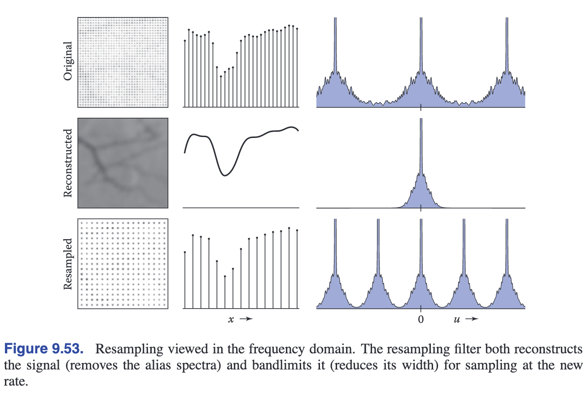

<!-- TOC -->

- [_9.1 Digital Audio: Sampling in 1D数字音频, 1维采样](#_91-digital-audio-sampling-in-1d数字音频-1维采样)
  - [_9.1.1 Sampling Artifacts and Aliasing](#_911-sampling-artifacts-and-aliasing)
- [_9.2 Convolution卷积](#_92-convolution卷积)
  - [_9.2.1 Moving Average](#_921-moving-average)
  - [_9.2.2 Discrete Convolution离散卷积](#_922-discrete-convolution离散卷积)
  - [_9.2.3 Convolution as a Sum of Shifted Filters](#_923-convolution-as-a-sum-of-shifted-filters)
  - [_9.2.4 Convolution with Continuous Functions](#_924-convolution-with-continuous-functions)
  - [_9.2.5 Discrete-Continuous Convolution](#_925-discrete-continuous-convolution)
  - [_9.2.6 Convolution in More Than One Dimension多维卷积](#_926-convolution-in-more-than-one-dimension多维卷积)
- [_9.3 Convolution Filters卷积滤波器](#_93-convolution-filters卷积滤波器)
  - [_9.3.1 A Gallery of Convolution Filters](#_931-a-gallery-of-convolution-filters)
  - [_9.3.2 Properties of Filters](#_932-properties-of-filters)
- [_9.4 Signal Processing for Images](#_94-signal-processing-for-images)
  - [_9.4.1 Image Filtering Using Discrete Filters](#_941-image-filtering-using-discrete-filters)
  - [_9.4.2 Antialiasing in Image Sampling图像采样中的反走样(反锯齿)](#_942-antialiasing-in-image-sampling图像采样中的反走样反锯齿)
  - [_9.4.3 Reconstruction and Resampling重建和重采样](#_943-reconstruction-and-resampling重建和重采样)
- [_9.5 Sampling Theory采样理论](#_95-sampling-theory采样理论)
  - [_9.5.1 The Fourier Transform傅立叶变换](#_951-the-fourier-transform傅立叶变换)
  - [_9.5.2 Convolution and Fourier Transform卷积和傅立叶变换](#_952-convolution-and-fourier-transform卷积和傅立叶变换)
  - [_9.5.3 A Gallery of Fourier Transform](#_953-a-gallery-of-fourier-transform)
  - [_9.5.4 Dirac Impulses in Sampling Theory迪拉克脉冲](#_954-dirac-impulses-in-sampling-theory迪拉克脉冲)
  - [_9.5.5 Sampling and Aliasing采样和走样](#_955-sampling-and-aliasing采样和走样)
  - [_9.5.6 Ideal Filters vs. Useful Filters](#_956-ideal-filters-vs-useful-filters)

<!-- /TOC -->

**Signal Processing**

在图形学中, 我们处理的是连续参数的函数.  
但是如果显示在屏幕上, 其实并不是连续的, 在上一章节里我们就能看到锯齿现象  
这就是因为我们只能对连续的函数做或密或疏的采样来显示  

所以**采样sampling**在图形学里是很重要的课题.  
还有, 根据采样来**重建reconstruction**也是很重要的课题  
为什么? 看下面的图

<a id="markdown-_91-digital-audio-sampling-in-1d数字音频-1维采样" name="_91-digital-audio-sampling-in-1d数字音频-1维采样"></a>
### _9.1 Digital Audio: Sampling in 1D数字音频, 1维采样  

  

这张图展示了声音从录制采样保存、到采样重建输出的过程.  
录制和再输出的过程都设计到采样, 如果采样不合理、没有做到平滑等等因素, 都会导致声音的失真  
下面这张图就展示了低采样率导致失真的原因:  
  

<a id="markdown-_911" name="_911"></a>
#### _9.1.1 Sampling Artifacts and Aliasing

同样的正弦波(sine wave), 因为低采样率(undersampling), 重建后的曲线完全变形  
因为低采样率, 高频信号变成了低频信号, 导致aliasing(锯齿/走样)  
表现在音频上就会出现异响杂音, 图像会出现moire patterns(摩尔纹)

对于采样和重建, 我们的疑问是:
- 多高的采样率能得到比较好的结果
- 什么类型的过滤器适合采样和重建(不同频率的数据采样对结果也会有影响)
- 什么程度的平滑能改善走样

<a id="markdown-_92-convolution卷积" name="_92-convolution卷积"></a>
### _9.2 Convolution卷积

Convolution是数学上的概念, 是指由两个函数生成另外一个函数, 表示为:
$$f \ast g$$
$f$ is convolved with $g$  
$f \ast g$ is the convolution of $f$ and $g$ 

Convolution适用于连续函数continuous function或者离散序列  
适用于单个参数的函数, 也适用于多个参数的函数

我们先从一位离散序列开始, 然后过渡到连续函数、多维连续函数
下面的说明假设参数取值是无限的

<a id="markdown-_921-moving-average" name="_921-moving-average"></a>
#### _9.2.1 Moving Average


如上图所示, 我们要对左边的曲线做平滑处理, 怎么做呢?  
我们对线上的某一个点, 取其左边距离r的范围, 以及右边r的范围, 对这个2r的范围的取值做平均, 替代当前点的值  

那么, 对于连续函数$g(x)$来说, 平滑之后的函数就是:
$$h(x) = \frac{1}{2r}\int_{x-r}^{x+r}g(t)dt$$
这个函数涉及到integral积分, dx是积分变量, wikipedis搜积分

对于离散序列:  
$$c[i] = \frac{1}{2r+1}\sum_{j=i-r}^{i+r}a[j]$$

moving average是convolution的核心.  
区别只是convolution是weighted average加权平均

<a id="markdown-_922-discrete-convolution离散卷积" name="_922-discrete-convolution离散卷积"></a>
#### _9.2.2 Discrete Convolution离散卷积

我们对两个sequence做convolution  
上面提到了对一个sequence做moving average, 只涉及到一个sequence, 我们对moving
average做一下变化, 将另外一个sequence参与进去:
$$(a \ast b)[i] = \sum_{j=-r}^{r}a[j]b[i-j]$$
增加了一个参数i, 用preseudo表示就是:

```
function convolve(sequence a, sequence b, int r, int i)
  s = 0
  for j = -r to r
    s = s + a[j]b[i-j]
  return s
```

看这张图:  
  
b本来很不规则, 在经过和a的convolution之后, 变得比较平滑了

- **Convolution Filters**

convolution之所以重要是因为它可以用来做filtering  

我们可以把9.1.1的moving average看作是一种特殊的的convolution:
$$
a[j] =
\left\{
  \begin{aligned}
  &\frac{1}{2r+1}\ \ \ \  &-r\le h \le r, \\
  &0\ \ \ \ &otherwise
  \end{aligned}
\right.
$$
在-r到r范围内a是恒定的值, 其他都是0  
将这个式子套在9.1.1就能得到9.1.2的式子  
这种筛选叫做**box filter**

举一个例子:
$$
b[i] =
\left\{
  \begin{aligned}
  &1\ \ \ \  &i \ge 0, \\
  &0\ \ \ \ &i \lt 0
  \end{aligned}
\right.
$$
$$
a[j] =
\frac{1}{5}
\left\{
  \begin{aligned}
  &1\ \ \ \  &-2 \le j \le 2, \\
  &0\ \ \ \ &otherwise
  \end{aligned}
\right.
$$

b可以看作是一个锯齿alias  
我们要把它平滑, 用a去做convolution  
取$r = 2$, 这样我们可以得到:  
当$i \lt -2$时, 结果都是0,  
当$i \le 2$时, 结果都是1,  
当$-2 \le i \le 2$时, 从0依次变化到1(做个推导就发现了)

太妙了!!!我们通过box filter convolution实现了平滑

- **Properties of Convolution**

concolution和乘法一样, 满足下面的特性:
$$
\begin{aligned}
&commutative: (a \ast b)[i] &= (b \ast a)[i] \\
&associative: (a \ast (b \ast c))[i] &= ((a \ast b) \ast c)[i] \\
&distributive: (a \ast (b + c))[i] &= (a \ast b + a \ast c)[i]
\end{aligned}
$$

我们对一个sequence进行多次filter时, 可以对filter的sequences进行计算, 然后在对此sequence进行filter  
有点像matrix transform

我们对一个sequence做convolution, 还是它自己:

$$(d \ast b)[i] = \sum_{j=0}^{j=0}d[j]b[i-j] = b[i]$$

$d[i] = ...,0,0,1,0,0,...$  
这个$d$被称为*discrete impluse*

<a id="markdown-_923-convolution-as-a-sum-of-shifted-filters" name="_923-convolution-as-a-sum-of-shifted-filters"></a>
#### _9.2.3 Convolution as a Sum of Shifted Filters

对convolution equation做个变化:  
$$(a \ast b)[i] = \sum_{j=-r}^{r}a[j]b[i-j]$$

我们把b做平移, 往右挪j个位置:  
  
这样表示:
$$b_{\to j}[i] = b[i-j]$$  
这样上面的式子就变成:  
$$(a \ast b) = \sum_j a[j]b_{\to j}$$

可以理解为多条偏移sequence的convolution的和, 如下图:  
  

<a id="markdown-_924-convolution-with-continuous-functions" name="_924-convolution-with-continuous-functions"></a>
#### _9.2.4 Convolution with Continuous Functions

对于连续函数的convolution, 和discrete sequence的convolution是类似的:
$$(f \ast g)(x) = \int_{-\infty}^{+\infty}f(t)g(x-t)dt $$

$$(f \ast g) = \int_{-\infty}^{+\infty}f(t)g_{\to t}dt $$

举个例子:  
$$
f(x) =
\left\{
\begin{aligned}
&1\ \ \ \ &-\frac{1}{2} \le x \lt \frac{1}{2}, \\
&0\ \ \ \ &otherwise
\end{aligned}
\right.
$$
自己对自己做convolution:
$$
(f \ast f)(x) = \int_{-\infty}^{+\infty}f(t)f(x-t)dt
$$
这个式子可以这么理解: f(x)和把f(x)偏移t之后, 两个函数相乘得到的面积, 如下图所示:  
  
$f(x)$是原函数  
在$x = 1/2$处, $f(t)$往右偏移1/2时, 两个函数相乘, 只有0-1/2的值是1, 其他都是0, 那么两者相乘得到的函数的面积就是1/2.  
在$x = -1$处, $f(t)$往左偏移1时, 在所有范围内, 两个函数相乘都是0  
所以最后会得到下面的图形.

- **The Dirac Delta Function**  

对于sequence有discrete impluse, 做convolution之后还是自己  
对于continuous function也有这样的情况  
一个一维函数除了0其他位置都是0, 0这个位置的值是无穷, 这个函数的面积是1, 这个函数可能没办法用equation来表达  
我们对一个函数用这个函数来做convolution, 得到的就是自己:
$$\int_{-\infty}^{\infty}\delta(x)f(x)dx=f(0)$$
因为这个式子里$delta(x)$不做偏移, 所以得到的结果就是$\delta(0)f(0)=f(0)$  
如果我们做偏移  
$$(\delta \ast f)(x) = \int_{-\infty}^{\infty}\delta(t)f(x-t)dt = f(x)$$  
所以$\delta \ast f = f$  
下面这张图能帮助理解:  
  

<a id="markdown-_925-discrete-continuous-convolution" name="_925-discrete-continuous-convolution"></a>
#### _9.2.5 Discrete-Continuous Convolution

discrete sequence和continuous function如何互相转换呢?  
continuous function转换成discrete sequence容易, 我们只需在整数位进行sampling即可, 即可得到一个sequence

如何从discrete sequence转换到continuous function呢? 这个过程其实就是9.1章节说的reconstruction重建  
我们对sequence用function做convolution:  
$$(a \ast f)(x) = \sum_ia[i]f(x-i)$$
书上是这么写的, 这种写法更像是用sequence去filter function. 但是convolution是满足交换律的, 其结果一样.  
我们按照用function去filter sequence去理解:  
假设filter的半径是2  
对于a[0], 经过filter之后的值应该是$a[-2]f(2) + a[-1]f(1) + a[0]f(0) + a[1]f(-1) + a[2]f(-2)$  
对于a[1], f应该往右shift 1位, 经过filter之后的值应该是$a[-1]f(2) + a[0]f(1) + a[1]f(0) + a[2]f(-1) + a[3]f(-2)$  
对于sequence上的整数index上的点我们能这么推导,  但是sequence经过function filter之后应该是一个continuous function, 这也是reconstruction的意义所在  
这意味着我们要把index之间的差值给内差出来  
例如当x = 5.3的时候, sequence应该取其临近的4, 5, 6, 7这4个index的值. f(x)的参数取值应该是1.3, 0.3, -0.7, -1.7, 得到的值是$a[4]f(1.3) + a[5]f(0.3) + a[6]f(-0.7) + a[7]f(-1.7)$
新的函数在x = 5.3的指应该是四项sequence的取值乘以function的值之和:
$$(a \ast f)(x) = \sum_{i = \lceil x-r\rceil}^{\lfloor x+r \lfloor}a[i]f(x-i)$$
用pseudocode表示:
```
function reconstruct(sequence a, filter f, real x)
s = 0
r = f.radius
for i = ⌈x-r⌉ to ⌊x+r⌋ do
  s = s + a[i]f(x-i)
return s
```
用多个shift函数之和来理解也很好:  


<a id="markdown-_926-convolution-in-more-than-one-dimension多维卷积" name="_926-convolution-in-more-than-one-dimension多维卷积"></a>
#### _9.2.6 Convolution in More Than One Dimension多维卷积

在图形学里, 我们处理的是二维图像, 二维如何做convolution呢?  
可以想像一个简单的场景, 我们有一个3X3的矩阵, 来对二维图像做convolution  
其中一个像素做convolution的值, 就是其周围9个像素的值乘以其对应的3X3矩阵的值之和:
$$(a \ast b)[i, j] = \sum_{i^{\prime} = -r}^{i^{\prime} = r} \sum_{j^{\prime} = -r}^{j^{\prime} = r} a[i^{\prime}, j^{\prime}]b[i-i^{\prime}, j-j^{\prime}]$$  
对于continuous function的理解和reconstruction的理解也同理:  


<a id="markdown-_93-convolution-filters卷积滤波器" name="_93-convolution-filters卷积滤波器"></a>
### _9.3 Convolution Filters卷积滤波器

上面的章节里说到了用convolution做filtering的机制, 下面我们介绍一些特殊的filter滤波器

<a id="markdown-_931-a-gallery-of-convolution-filters" name="_931-a-gallery-of-convolution-filters"></a>
#### _9.3.1 A Gallery of Convolution Filters

- **The Box Filter**

在上面的例子里面已经讲到了, 就是对要做筛选的sequence或者function, 半径为r范围内的值做平均  
对于discrete sequence:
$$
a_{box, r}[i] =
\left\{
  \begin{aligned}
  &\frac{1}{2r+1}\ \ \ \  &-r\le i \le r, \\
  &0\ \ \ \ &otherwise
  \end{aligned}
\right.
$$
对于continuous function
$$
f_{box, r}[x] =
\left\{
  \begin{aligned}
  &\frac{1}{2r}\ \ \ \  &-r\le x \le r, \\
  &0\ \ \ \ &otherwise
  \end{aligned}
\right.
$$

这个filter在坐标系下像一个box

- **The Tent Filter**

$$
f_{tent}(x) =
\left\{
  \begin{aligned}
  &1 - |x|\ \ \ \ &|x| \lt 1, \\
  &0\ \ \ \ &otherwise;
  \end{aligned}
\right.
$$

这个filter在坐标系下像一个tent  
filter可以做变换, 变高一点, 变矮一点

- **The Gaussian Filter**

一条抛物线, 用于smoothing

- **The B-spline Cubic Filter**

一般用于reconstruction

- **The Catmull-Rom Cubic Filter**

一般用于reconstruction

- **The Mitchell-Netravali Filter**

上面两个filter的组合优化

<a id="markdown-_932-properties-of-filters" name="_932-properties-of-filters"></a>
#### _9.3.2 Properties of Filters

filters有一些术语:  

- impulse response脉冲响应
- interpolating内插
  如果一个continuous filter用于对一个discrete sequence重建, 重建后的continuous function并不是一个新的函数, 意思是这个函数还是链接了sequence上的点, 那么这个filter就是interpolating
- ringing or overshoot
  一个filter进行reconstruction时有额外震荡, 我们称这种现象叫ringingh或者overshoot  
  
- ripple free无缺陷
- degree of continuity连续度
  用来表示continuous filter的平滑程度, 可影响reconstruction结果

- **Separable Filters可分离的过滤器**

我们在上面讨论的都是1D的filter, 多维的filter可以根据1D的filter推导而来  
一个2D的separable filter是两个1D filter相乘:  
$$f_2(x, y) = f_1(x)f_1(y)$$  
对于discrete sequence:
$$b_2[x, y] = b_1[x]b_1[y]$$  
所以1D的filter确定了, 2D的filter也就确定了

我们看一些例子:
**The separable tent filter**  
1D的tent filter是一个tent的截面, 2D的filter是一个3D的tent  
**The separable gaussian filter**
1D的gaussian filter是一个抛物线, 2D的filter是一个平滑的隆起

convolution的计算同理, 9.2.6章节做了简单的说明, 这里暂且不详述, 用到时再详看不迟

<a id="markdown-_94-signal-processing-for-images" name="_94-signal-processing-for-images"></a>
### _9.4 Signal Processing for Images

我们讲到了sampling采样, filtering过滤, reconstruction重建, 以及相关的计算  
我们看看它们在图像处理上的作用

<a id="markdown-_941-image-filtering-using-discrete-filters" name="_941-image-filtering-using-discrete-filters"></a>
#### _9.4.1 Image Filtering Using Discrete Filters

我们在手机上用到的图片锐化、图片模糊就是用到了filter

最常用的是discrete convolution  
blur模糊最好处理, 用box filter, tent filterm gaussian filter都可以实现  
sharpen锐化、drop shadow去除阴影, 相对较复杂, 需要几个filter结合来实现

<a id="markdown-_942-antialiasing-in-image-sampling图像采样中的反走样反锯齿" name="_942-antialiasing-in-image-sampling图像采样中的反走样反锯齿"></a>
#### _9.4.2 Antialiasing in Image Sampling图像采样中的反走样(反锯齿)

在图像合成中, 我们需要对一个图像image进行采样表示(这个图像有continuous数学公式表示, 或者我们进行像素采样).  
我们不做一些特殊处理的话, 往往得到的结果会走样, 在尖锐的地方会出现aliasing锯齿, 这种锯齿规律的出现就叫moire patterns摩尔纹

对付这种情况, 在第四章里讲到需要将图像blur模糊, 再进行采样, 可以缓解这aliasing  
不同的filter效果不一样, 比如gaussian filter的效果比box filter更好, 但是代价是更模糊.  
antialiasing的核心就是在sharpen和aliasing之间做平衡.

<a id="markdown-_943-reconstruction-and-resampling重建和重采样" name="_943-reconstruction-and-resampling重建和重采样"></a>
#### _9.4.3 Reconstruction and Resampling重建和重采样

最常见的图像操作是resampling, 包括调整采样率、调整大小  

如果我们要把一个高分辨率的图像调低分辨率, 比如3000X2000调整为1280X1024  
最简单直接的方法就是平均删除掉多余的像素, 但是这种方法会导致aliasing, 不过倒是可以用在缩略图预览上  

更好的方法是对discrete sequence进行construction得到continuous function表达, 然后再进行resampling. reconstruction的filter需要仔细选择. 流程如下图所示:  
  

我们降级到1D来说明这个过程, resample的过程就是:
```
function resample(sequence a, float x0, float ∆x, int n, filter f)
  create sequence b of length n
  for i = 0 to n-1 do
    b[i] = reconstruct(a, f, x0 + i∆x)
  return b
```
从一个sequence a resample得到sequence b  
b的长度是n, 从$x_0$开始采样. reconstruct是9.2.5章节的函数  
经历了两个过程, reconstruct重建, 然后重新采样.  
重建之后为了antialiasing, 可以再做一次smooth. reconstruct和smooth都是filtering, 满足结合律, 可以将两者合并, 如下图:  
  
两个filter结合后, 被称为resampling filter

2D的图像处理, 留到用时再细看

### _9.5 Sampling Theory采样理论

如果只对实现j感兴趣, 这一章可以不看了.  
不过采样理论可以让你对上面的内容有更深的理解, 而且能帮助你写出更高效的代码.  

#### _9.5.1 The Fourier Transform傅立叶变换

傅里叶变换与卷积，是支撑采样理论的主要数学概念。

傅立叶变换可以把一个函数拆解成很多个不同频率的正弦波  
比如说一个box function可以由无限多个正弦波得到:
$$\int_{-\infty}^{\infty}\frac{sin\pi u}{\pi u}cos2\pi ux du$$
傅立叶变换通用的表示为:
$$f(x) = \int_{-\infty}^{\infty}\hat{f}(u)e^{2\pi iux}du$$
反过来:
$$\hat{f}(u) = \int_{-\infty}^{\infty}f(x)e^{-2\pi iux}dx$$
$\hat{f}$称作原函数$f$的傅里叶变换  
$\hat{f}$告诉我们如何用一系列正弦波的积分构造$f$  
$f$的傅立叶变换$\hat{f}$也可表示为$\mathfrak{F}\{f\}$

$\hat{f}$可以有无限多个正弦波组成, 在书中最开始举的最简单的例子里, 一个函数由一个sequnece的正弦波组成, 完美的情况下, 这个sequence应该可以替换成cotinuous function, 也就是说一个函数可以有一个连续函数的正弦波组成, 这个连续函数就是$\hat{f}$, 它表示了正弦波的频率, 也就表示了: 如果$f(x)$由无限多个正弦波构成, 正弦波的频率分布就可以用$\hat{f}$表示  
(后面的du是积分的参数, 也就是切分的大小.)

#### _9.5.2 Convolution and Fourier Transform卷积和傅立叶变换  

两个函数的卷积的傅立叶变换, 等于两个函数的傅立叶变换相乘
$$\mathfrak{F}\{f \ast g \} = \hat{f}\hat{g}$$ 
两个函数的傅立叶变换的卷积, 是两个函数相乘后的卷积
$$\hat{f} \ast \hat{g} = \mathfrak{F}\{fg\}$$

傅立叶变换参与到卷积中, 引出一个全新的概念: the frequency domain频域


上面说到的filter有的不能用函数来表示, 比如box filterm, 就可以用傅立叶变换函数来表示了:  


#### _9.5.3 A Gallery of Fourier Transform

之前介绍的几种filter就可以用他们的傅立叶变换来表示:  
- box filter
$$\mathfrak{F}\{f_{box}\} = \frac{sin\pi u}{\pi u} = sinc\ \pi u$$
- tent filter
$$\mathfrak{F}\{f_{tent}\} = \frac{sin^2\pi u}{\pi^2 u^2} = sinc^2\ \pi u$$
- B-spline filter
$$\mathfrak{F}\{f_B\} = \frac{sin^4\pi u}{\pi^4 u^4} = sinc^4\ \pi u$$
- Gaussian filter
$$\mathfrak{F}\{f_G\} = e^{-(2\pi u)^2/2}$$

#### _9.5.4 Dirac Impulses in Sampling Theory迪拉克脉冲

dirac函数是指除了0位置, 其他位置都是0, 0位置的值是无穷大, 这个函数的面积是1  
所以我们对一个函数进行等距采样时, 就是对这个函数等距乘以dirac函数, 得到一个脉冲串impulse train, 距离是T, 那么这个脉冲串可以表示为:
$$s_T(x) = \sum_{i=-\infty}^{\infty}\delta(x-Ti)$$

如果我们对整数频率的正弦波用脉冲串取样后求和, 就会得到$\infty$, 如果非整数, 求和会趋近0

周期为$T$的impulse train的forier transform是一个周期为$1/T$的impulse train  
这里只说结论, 为什么? 不知道, 自己去查

#### _9.5.5 Sampling and Aliasing采样和走样

在采样sampling和重建reconstruction的过程中, 频域frequency domain起到什么作用呢?  
fourier transform能够解释为什么我们在sampling和restruction时需要filtering  

我们对一个函数做脉冲采样, 就是$fs_T$, 再对其做fourier transform, 也即是得到采样之后的频域: $\hat{f}\hat{s}_T$, 根据impulse train的特性:
$$\hat{f} \ast \hat{s}_T = \hat{f} \ast s_{1/T}$$
从而得到:
$$(\hat{f} \ast s_{1/T} = \sum_{i=-\infty}^{\infty}\hat{f}(u - i/T)$$
这意味着什么呢? 本来图片函数的频域是正常的抛物线, 进过采样之后变成了一个周期为$1/T$的线  
也就是说，用impulse train对函数进行convolution会产生一系列等距的频谱拷贝。对这个看似奇怪的结果的一个很好的直观解释是，所有这些副本只是表达了一个事实（正如我们在第9.1.1节看到的那样），即一旦我们采样了，相差采样频率的整数倍的频率是无法区分的。  

这样就导致了高频部分的重叠overlap, 从而产生aliasing    
reconstruction也是会造成重叠overlap  
  

- **Preventing Aliasing in Sampling**

  有两种方法: 1提高采样频率, 2filtering

  提高采样频率比较好理解, T足够小, 那么1/T足够大, 大到能够覆盖整个频域, 就不会出现重叠的现象了, 如下图:  
    

  filtering滤波, 我们把高频部分过滤掉(或者说模糊掉), 这样就能减少overlap引起的aliasing了, 如下图:  
  
  我们看到strong blur相比middle blue过滤掉了更多的高频信号, 从而减少overlap

- **Preventing Aliasing in Reconstruction**

  reconstruction也是一样, 需要用低通滤波器low-pass filter过滤掉高频信号, 减少aliasing:  
    
  我们再对比一下不同的filter的效果:  
    
  一个好的reconstruction filter必须是一个好的lowpass filter

- **Preventing Aliasing in Resampling**

  我们重采样时, 比如一个高采样率的结果, 再用低采样率采一遍, 并不是直接从1000个采样点里取其中的800个点  
  而是根据这1000个采样点reconstruction, 根据合适的lowpass filter去除重复的频谱和高频信号, 再进行采样:  
  

#### _9.5.6 Ideal Filters vs. Useful Filters

the sinc filter并不常用  
Gaussian filter有很好的效果

