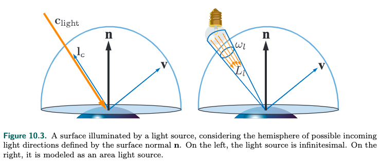

<!-- TOC -->

- [_10.1 Area Light Sources](#_101-area-light-sources)
- [_10.2 Environment Lighting](#_102-environment-lighting)
- [_10.3 Spherical and Hemispherical Functions](#_103-spherical-and-hemispherical-functions)
  - [Spherical Harmonics](#spherical-harmonics)
- [_10.4 Environment Mapping](#_104-environment-mapping)
- [_10.5 Specular Image-Based Lighting](#_105-specular-image-based-lighting)
  - [_10.5.1 Prefiltered Environment Mapping](#_1051-prefiltered-environment-mapping)
    - [Convolving the Environment Map](#convolving-the-environment-map)
  - [_10.5.2 Split-Integral Approximation for Microfacet BRDFs](#_1052-split-integral-approximation-for-microfacet-brdfs)

<!-- /TOC -->

**Local Illumination**

之前介绍过punctual light source, 但是实际场景里是不存在的, 都是area light.  
另外还有环境光照的问题, 没有光源直接照射, 也会因为日光等光源的反射而被照亮. 环境光照适用于大型的、复杂的、但是强度较低的光源.    
本章节就是为了解决这些问题. 其中的重要一项内容是, 为了让rendering更真实, 一般都需要进行多次采样, 比如对着色点半球内的光照多次采样, 但是这样非常慢, 我们看看有没有更好的数学方法.

### _10.1 Area Light Sources

左侧是punctual light, 右侧是area light  
右侧的area light的情况, 光源照射范围是立体角$\omega_l$, $L_l$是光源的radiance, 我门应该对这个光照范围做积分才是真正的结果, 不过我们可以把它近似为punctual light, 这样:
$$L_o(v) = \int_{l \in \omega_l}f(l, v)L_l(n \cdot l)^+dl \approx \pi f(l_c, v)c_{light}(n \cdot l_c)^+$$

光源面积和surface的glossy对光照的效果有影响. 光源的面积构成一个立体角, 光源越大, 立体角越大, surface的glossy程度也够成一个立体角, surface越粗糙, 反射的立体角也越大. 这两个立体角的相对大小决定了光照效果. 书上贴了一张图, 大的光源照射光滑的surface的效果和小的光源照射粗糙的surface的效果类似.  
根据这个特性, 对面光源的其中一个解决方案是把它当作punctual light, 但是增加surface的粗糙程度. 这显然不是一个好的解决方案.

对于lambertian场景, BRDF $f(l, v) = \frac{\rho_{ss}}{\pi}$, BRDF的定义是出射方向的radiance除以入射方向的irridiance, 那么:
$$L_o(v) = \frac{\rho_{ss}}{\pi}E$$

计算光源的irridiance:
$$E = \int_{l \in \omega_l}L_l(n \cdot l)dl \approx \pi c_{light} (n \cdot l_c)^+$$
这是对于punctual light  

对于area light, 需要做一下调整, 其实就是trick:
$$E = \pi c_{light} \left(\frac{(n \cdot l) + k_{wrap}}{1+k_{wrap}}\right)^+$$
$k_wrap$可以自己做调整, 如果是0, 就是punctual light, 如果是1, 就是覆盖整个半球的area light.

// TODO 10.1.2 LTC

### _10.2 Environment Lighting

我们到现在为止讨论的都是直接光照, 但是实际场景里一个点接受到的光照, 除了radiance比较强的直接光照, 还有从四面八方接受到的radiance比较弱的间接光照, 这些光照可能是其他物体反射的, 这就涉及到global illumination.  
这里我们不讨论global illumination. 我们把间接光照独立开来, 和其他物体表面没有关系, 把它当作一个独立的光源ambient light, 它的radiance是一个恒定值$L_A$.  
这样, 对于lambertian surface, BRDF $f(l, v) = \frac{\rho_{ss}}{\pi}$, 我们可以根据reflection equation得到:
$$
\begin{aligned}
  L_o &= \int_{l \in \Omega}f(l, v)L_A(n \cdot l)dl \\
      &= f(l, v)L_A\int_{l \in \Omega}(n \cdot l)dl \\
      &= \frac{\rho_{ss}}{\pi}L_A\int_{l \in \Omega}(n \cdot l)dl \\
      &= \rho_{ss}L_A
\end{aligned}
$$
我们就会惊奇的发现, subsurface albedo $\rho_{ss}$就是blinn-phong模型环境光照里的参数. 

### _10.3 Spherical and Hemispherical Functions

上面我们说ambient light的radiance是一个定值$L_A$, 我门扩展一下, randiance能不能变化? 不同的方向的radiance是不同的.   
这就需要用到spherical function, 它定义在一个单位球面上.  
定义这个函数, 根据角度和法线能就能算出radiance.

#### Spherical Harmonics

TODO

### _10.4 Environment Mapping

将记录radiance的spherical function记录在image上, 称之为environment mapping.  
和texture mapping不同的是, 它记录的值的范围比较大, 所以更占空间, 读取速度也会慢一些.  

从environment mapping获取了radiance之后应该怎么处理呢? 我们根据镜面反射模型来计算我们看到的radiance:
1. 根据v和n得到r: $r = 2(n \cdot v)n - v$
2. 根据r从environment mapping获取$L_i(r)$
3. 根据fresnel term反射率得到我们看到的radiance: $L_o = F(n, r)L_i(r)$

这种方法也叫image based lighting(*IBL*)

根据$r$获取radiance有多种方法, 这里暂时不详述.

### _10.5 Specular Image-Based Lighting

在10.4章节里, 我门讲到用environment mapping来计算镜面反射的radiance.  
但是实际情况并不会有完美的镜面反射, 反射会在一个区域发生, 在9.3章节的最后有张图做了详细的说明.  
因为互换性, 我们看到的某个点的radiance也是从一个区域照射到这个点然后反射到我门的眼睛.

我门可以对environment map texture进行模糊处理, 就是将这个区域的randiance进行了平均, 这样就相当于specular reflection, 效果比mirror-like reflection要好.  

如果BRDF分布是均匀的, 做平均模糊(相当于mipmap)就可以了. 但是实际情况BRDF的形状是不规则的, 怎么做模糊(filter)是一个问题.

#### _10.5.1 Prefiltered Environment Mapping

对于Phong模型, 它不考虑物理情况, 处理方式是l相对于n对称的方向作为镜面反射的方向, 然后用v和l的half vector h和n的余弦来调整specula reflection的范围大小. 这个大小范围反映了surface的粗糙程度.    
这样我们就能根据这个范围大小来对environment map提前进行模糊处理.

##### Convolving the Environment Map

提前filter或者将均匀filter的不同分辨率的map结合起来进行实时计算

#### _10.5.2 Split-Integral Approximation for Microfacet BRDFs

// TODO split sum
// TODO PBR, spherical harmonics
