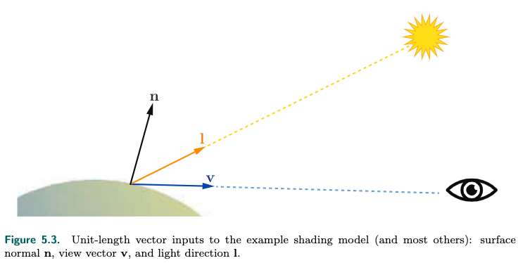
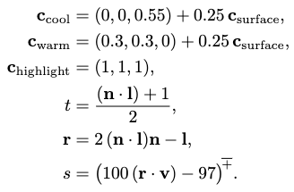
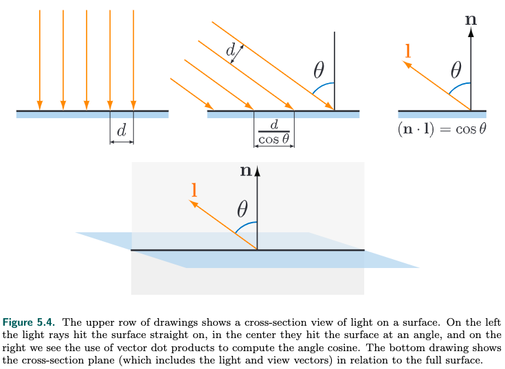
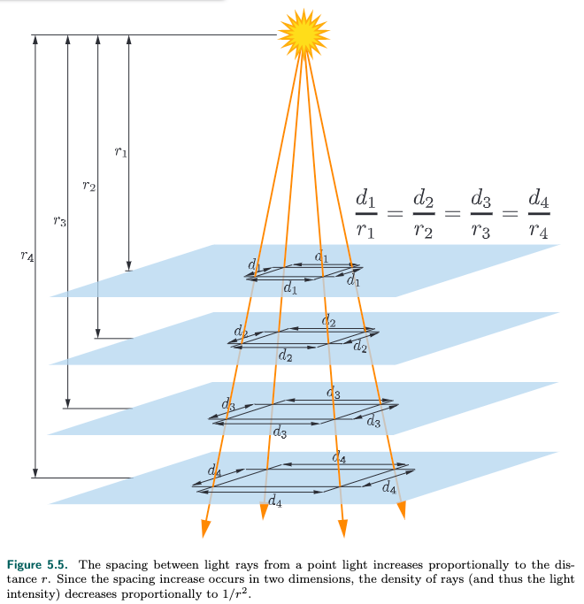
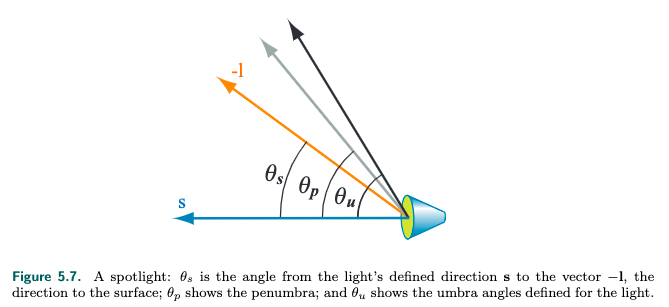
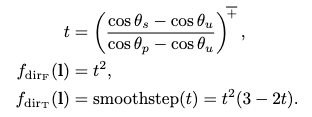

<!-- TOC -->

- [_5.1 Shading Models着色模型](#_51-shading-models着色模型)
- [_5.2 Light Sources光源](#_52-light-sources光源)
  - [_5.2.1 Directional Lights定向光源](#_521-directional-lights定向光源)
  - [_5.2.2 Punctual Lights](#_522-punctual-lights)
    - [Point/Omni Lights](#pointomni-lights)
    - [Spotlights](#spotlights)
    - [Other Punctual Lights](#other-punctual-lights)
  - [_5.2.3 Other Light Types](#_523-other-light-types)
- [_5.6 Display Encoding](#_56-display-encoding)

<!-- /TOC -->

**Shading Basics**

我们渲染三位物体时, 出了其几何形状, 还需要渲染出它的视觉效果. 视觉效果可以是写实的, 就像照片一样, 也可以时风格化的, 比如动画风, 这两种形式在着色原理上是共通的.

### _5.1 Shading Models着色模型

shading model是什么? 是说我们对一个物体进行着色, 我们需要找到几个因子, 通过特定的计算方式, 得到这个物体的颜色.  

我们拿一种风格化的shading model作为例子来讲解: Gooch Shading Model.  
典型的场景如下所示, 三个方向分别指物体表面的normal, light direction, 和 view direction.  
  
这个shading model的规则是物体表面的发现越接近指向光源, 就用暖色来着色, 如果远离光源, 那就用冷色, 中间的情况用插值. 可以用这个等式来计算:
$$c_{shaded} = sc_{highlight} + (1-s)(tc_{warm} + (1-t)c_{cool})$$
这里面的变量可以这样计算:  
  
$c_{hight}, c_{warm}, c_{cool}$可以指定, 不过后面两者需要加上物体的颜色.  
那么s和t怎么计算呢?  
我们看到他们都是用x乘以一个值, 1-x乘以另外一个值, 这就是在做插值.  
拿$tc_{warm}+(1-t)c_{cool}$来说, t应该是跟normal和light direction有关, n和l越近, t应该越大, 所以用n和l的product dot来计算t. 因为n和l越靠近, 他们的dot product越大. 为什么加1再除以2, 这是做了[clamping operation](https://en.wikipedia.org/wiki/Clamping_(graphics)), $n \cdot l$的范围是[-1, 1], 这样处理之后, 就可以得到一个[0, 1]的值.  
那么s呢? s应该跟view direction有关, v越靠近反射方向, 那么highlight越强烈. 反射方向的向量就是r(画图推导一下即可理解), 然后再做一下数值调整(可以调整highlight的大小)和clamping operation到[0, 1]之间.  
这就是Gooch Shading Model.

### _5.2 Light Sources光源

在上面的Gooch Shading Model里, 光是从一个恒定的方向照射过来的, 且只有一个光源.  
现实世界里光源是多重多样的, 不同的尺寸、颜色、形状、强度. 简单的shading model可能不用考虑这么多, 但是对于photorealistic真实感的shading, 那么这些因素都要考虑了.

光源对于shading来说非常重要, 场景中不是所有物体表面都被光源照射, 比如surface的normal和光源方向l的夹角大于90度(也就是背对光源). 所以我们把一个点的着色可以分成两个部分, 光源照射的部分和光源不照射的部分:
$$c_{shaded} = f_{unlit}(n, v) + k_{light}f_{lit}(l, n, v)$$
可能有人问, 为什么要考虑不被光源照射的部分, 不被光源照射那不就是黑的阴影吗? 可能某些风格的shading model是这样的, 但是大多数场景, 没有被光源直接照射, 但是还会有环境光, 比如各种反射的光. 把光源拿掉, 也一样是有亮度和颜色的.  
我们把光源强度$k_{light}$换成光源的颜色:
$$c_{shaded} = f_{unlit}(n, v) + c_{light}f_{lit}(l, n, v)$$
如果有多个光源, 那么:
$$c_{shaded} = f_{unlit}(n, v) + \sum_{i=1}^{n}c_{light_i}f_{lit}(l_i, n, v)$$
我们再来看看$c_{light}$这一项, 光源照射surface的强度和照射角度相关:  
  
如果照射角度是$\theta$, 那么同样的两根光线的照射面积会变大成$\frac{d}{\cos\theta}$, 所以强度会变小$\cos\theta$, 余弦可以通过l和n的dot product计算出来, 所以上面的等式可以变成:
$$c_{shaded} = f_{unlit}(n, v) + \sum_{i=1}^{n}(l_i \cdot n)^+c_{light_i}f_{lit}(l_i, n, v)$$
加上一个+符号, 是讲又可能是负值的ln的dot product变成0.  
我们还可以把$f_{lit}()$简化成物体变面的颜色:
$$c_{shaded} = f_{unlit}(n, v) + \sum_{i=1}^{n}(l_i \cdot n)^+c_{light_i}c_{surface}$$
这就是大名鼎鼎的lambertian shading model, 瑞士科学家lambert在18世纪发明的. 当然, 这个模型有其局限性, 比如只能适用于diffuse的场景.  

接下来我们讨论多种类型的光源, 这些光源都是点光源. 面光源在其他章节讲解.

#### _5.2.1 Directional Lights定向光源

方向l和强度$c_{light}$恒定的光源称之为directional light, 这是最简单的光源.  
这样的光源是没有位置的, 但是实际没有这样的光源, 如果光源相比于物体足够远, 那么就可以把光源看成是一个directional light.  
有些创意场景下将directional light的强度设定为可以变化.

#### _5.2.2 Punctual Lights

punctual light是指有位置的光源, directional light没有位置, punctual light有位置.  
直译是点光源, punctual来源于拉丁文punctus(point点), 但是直译不太准确, 因为point light也可翻译成点光源, 但是point light是指从一个点往四面八方发射同等强度的光, 但是punctual light包括spotlight聚光灯.

和directional light的光线方向恒定不同, punctual light的光线方向由光源的位置$p_{light}$和着色点的位置$p_0$决定:
$$l = \frac{p_{light} - p_0}{\left\|p_{light}-p_0\right\|}$$
向量除以其距离得到单位向量  
这个等式分解一下计算步骤:
$$
\begin{aligned}
  d &= p_{light} - p_0 \\
  r &= \sqrt{d \cdot d} \\
  l &= \frac{d}{r}
\end{aligned}
$$
$r$就是光源和着色点的距离, 向量和自己dot product等于其长度的平方.  
为什么要分解呢, 因为$r$可以计算光的attenuation衰减

##### Point/Omni Lights

这里主要介绍光的衰减, 上面提到了衰减和距离相关, 如何相关呢, 看下图:  
  
4条光线构成一个正方向, 随着距离增加, 覆盖的面积随着距离增加而增加, 和距离的平方成正比, 强度不变, 那么单位面积的强度就和距离平方成反比. 或者这样思考: point light向四面八方发射光线, light位置为中心的球体面积是$4\pi r^2$, $r$就是半径, 光源强度不变, 球体上的一个点接收到的强度也就跟$r^2$成反比.  
假定我们测量在$r_0$处测得光源强度是$c_{light_0}$, 那么在$r$处的光源强度就是:
$$c_{light}(r) = c_{light_0}\left(\frac{r_0}{r}\right)^2$$
这个等式称之为inverse-square attenuation equation.

这个等式有两个问题, 一个是$r$接近0的时候, 强度会变成无限大, 于是我们加上一个常数:
$$c_{light}(r) = c_{light_0}\frac{r_0^2}{r^2+\epsilon}$$
unreal engine里$\epsilon = 1cm$  
有的engine采用这样的方式:
$$c_{light}(r) = c_{light_0}\left(\frac{r_0}{max(r, r_{min})}\right)^2$$
这个$r_min$可以解释为光源的半径

另外一个问题是, 光源强度可以衰减到无限远, 但是在实际场景里到一定的距离光源就衰减到消失了.  
不同的engine不同的场景有不同的处理方式, 其中一种方式是将这个等式乘以一个window function:
$$f_{win}(r) = \left(1-\left(\frac{r}{r_{max}}\right)^4\right)^{+2}$$
这里设定了一个$r_{max}$, 乘以这个函数之后, 光就会在$r_{max}$处衰减到0. +2是做clamping operation, 小于0时将其clamping成0.  
有的engine是将光源强度在$0.8r_{max}$到$r_{max}$范围内做线性衰减到0.  
有的engine一样时用window function, 但是为了计算效率, 将4次方改成2次方.  
有的场景下为了风格会混用.

##### Spotlights

point light根据距离的增加而衰减, 而现实中很多光源还因为角度而衰减.  
比如spotlight:  
  
spotlight的光照范围是一个圆锥, s是圆锥的中心线, 光照方向-l和point light一样, 也是从着色点到光源位置的向量.  
s和灰色的线构成penumbra angle $\theta_p$, s和黑色的先构成umbra angle $\theta_u$  
$\theta_p$范围内的光照强度最强, $\theta_p$到$\theta_u$范围内的光照强度会衰减, 超出$\theta_u$范围的光照强度会变成0.  
这样, 我们计算光照强度还要加上角度:
$$c_{light} = c_{light_0}f_{dist}(r)f_{dir}(l)$$
角度的衰减函数在不同的engine里不一样, 列举两种:
  
第一种是一个游戏引擎的算法, 第二种是three.js的算法  
这些都是shading language的内置函数

##### Other Punctual Lights

上面讲了两种衰减方式, 我们还可以设计出其他衰减方式, 比如在XYZ轴分别衰减, 比如根据时间衰减, 等等.

#### _5.2.3 Other Light Types

上面介绍的光源的光照方向, 一个是固定的, 一个是着色点和光源位置的连线.  
我们还可以做一些变化, 比如古墓丽影里有线光源, 光照方向是着色点和光源线段最近的点的连线.  
还有面光源, 可以生成penumbra、soft shadow.

### _5.6 Display Encoding

计算光照、纹理、和其他操作时, 用到的值都是线性的, 所以可加法和乘法.  
但是为了消除visual artifacts, 显示器buffer和texture使用非线性的encoding.  
简单的说: shader的输出范围是[0, 1], 将其提高到其1/2.2次方, 这个操作称为gamma correction.  
显示器对传入的texture和color再进行相反的操作.  
在大多数情况下, 我们告诉GPU做这些操作即可.  
这一章节将会介绍为什么要这么做.

可以参照[fundamentals of computer graphics: 3.2.2 Monitor Intensities and Gamma](docs/FundamentalsofComputerGraphics/3_raster_images?id=_322-monitor-intensities-and-gamma)  
本章内容暂且搁置.