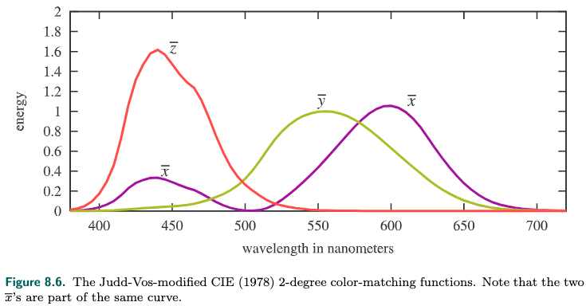
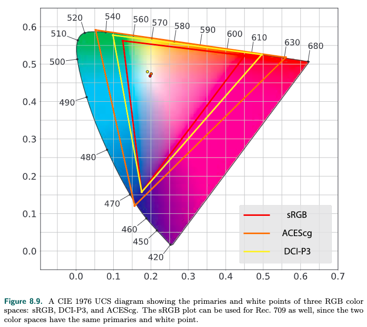

<!-- TOC -->

- [_8.1 Light Quantities光的度量](#_81-light-quantities光的度量)
  - [_8.1.1 Radiometry](#_811-radiometry)
  - [_8.1.2 Photometry](#_812-photometry)
  - [_8.1.3 colorimetry](#_813-colorimetry)
  - [_8.1.4 Rendering with RGB Colors](#_814-rendering-with-rgb-colors)

<!-- /TOC -->

**Light and Color**

### _8.1 Light Quantities光的度量

从物理角度来度量light我们用radiometry  
从人的感知角度来度量light我们用photometry  
色彩的感知我们用colorimetry

#### _8.1.1 Radiometry

radiometry通过电磁辐射的方式来度量light  
电磁辐射有wavelength, 可见光只是一小部分波长范围的电磁辐射  
radiometry通过下面几种单位来度量light的强度、功率等等:
- radiant flux: 功率  
  radimetry的基本单位, 电磁辐射能量除以时间, 用$\Phi$表示, 单位是watt($W$)
- irridiance:  
  功率再除以面积, 一般用在物体表面, 用$\textit{E}$表示, 单位是$W/m^2$
- radiant intensity:  
  功率除以solid angle, 单位是steradians(sr), 用$\textit{I}$表示, 单位是$W/sr$  
  注: 角度angle是指二维平面上的角度, 单位用radians弧度表示, 而solid angle是指三维空间中的角度. radians是指单位角度在半径是1的圆的弧长, 一个单位圆的radians是2π.  
  steridians就是指单位solid angle在半径是1的球体上的面积, 一个球体的steridians是4π.
- radiance:  
  radiance这个概念在rendering非常重要, 因为camera和eye感知的就是radiance, 它描述了单条射线的强度  
  radiance是功率除以面积再除以solid angle, 用$\textit{L}$表示, 单位是$W/(m^2sr)$  
  因为要除以面积, 就跟入射角度有关系, 面积需要乘以余弦  
  radiance的特性是跟距离、环境无关, 例如我们观察一个物体表面反射的光, 这个反射光的radiance和我们观察的距离和环境无关.  

很多light并不是单一波长构成的, 是有多种波长组成, 我们称之为spectral power distribution(SPD), 但是我们并不用波长来表示light, 因为人眼感受到的是颜色, 并不能很精确的感受到波长, 甚至有些不同的波长组合, 人感受到的颜色是一样的, 所以我们用RGB来表示颜色.

这部分内容在[fundamentals of computer graphics](docs/FundamentalsofComputerGraphics/18_light.md)里也有介绍.

#### _8.1.2 Photometry

radimetry是从物理角度来度量light, 跟人的感知没有关系.  
photometry则是从人的感知角度来度量light.  
photometry的度量方式是和radiometry对应的, 上面讲到了radiometry用4种单位来度量light, photometry也有对应的4种单位, 且含义是一样的  
两者之间有换算关系, 对radiometry的单位乘以一个常数即可, 这个常数根据不同的wavelength而不同, 表现为一条曲线, 书中有图.  
4个单位的对应关系是:

|radiometry:units|photometry:units|
|-|-|
|radiant flux: $\Phi=watt(W)$|luminous flux: lumen(lm)|
|irridiance: $\textit{E}=W/m^2$|illuminance: lux(lx)|
|radiant intensity: $W/sr$|luminous intensity: candela(cd)|
|radiance: $\textit{L}=W/m^2sr$|luminance: $cd/m^2=nit$|

luminance用来表示物体表面的亮度, 例如HDR电视的亮度是50-100nits

#### _8.1.3 colorimetry

8.1.1章节说到我们感受到颜色和SPD(spectral power distribution)相关, 但是这并不是一一对应的, 不同SPD的光我们感受到的颜色可能是一样的. colorimetry就是处理SPD和颜色的关系.

人类之所以能感受到颜色, 是因为人的retina视网膜里面有三个视锥体, 能感受到不同wavelength, 所以我们用三个变量来表示颜色.

CIE(国际照明委员会)制定了RGB三原色, 通过调整三原色的强度来测量不同波长的单波长颜色, 得到r的wavelength是645nm, g是526nm, b是444nm.  
CIE定义了三个参数$\textit{X, Y, Z}$来表示不同波长的颜色, 这个公式称之为color-matching functions. 这三个系数并不对应rgb, 其中$\textit{Y}$对应亮度(luminance), 测量出来可以得到这样的曲线:

对于SPD的光呢(也就是不是单一wavelength, wavelength分布在一定范围), 我们采用积分的方式, 计算曲线覆盖的面积, 计算得到三个面积$\textit{X, Y, Z}$.

我们还可以把三个系数减少为两个系数, 将三个系数转换为0-1的空间, $x = \frac{\textit{X}}{\textit{X+Y+Z}}, y=\frac{\textit{y}}{\textit{X+Y+Z}}, z=1-x-y$, 这样我们只需要xy值, 从而得到下面的图:

黑色的曲线是wavelength, 两个端点是wavelength的上下界.  
xy值经过了缩放, 只能表示颜色的构成, 但是颜色还有一个特性是亮度(luminance), 相同的颜色可能有不同的亮度.

显示器有RGB三通道, 三通道控制显示元件发出不同系数不同强度(缩放)的光线从而显示不同的颜色.  

上图有三个三角形, 分别是不同的显示器能显示的颜色范围, 三个顶点是能显示最高饱和度的RGB三色, 所以他们的白点也是不一样的.  
再加上不同的强度就构成了不同的RGB space. RGB和XYZ有换算关系, 不同的RGB space不一样.

在real time rendering里sRGB space应用最普遍.

#### _8.1.4 Rendering with RGB Colors

严格的说, 我们用RGB来做基于物理的渲染是错误的, 因为RGB时基于人的感知, 而不是基于物理的spectral.  
更准确的方法是用spectral渲染, 然后转换为RGB.  

但大多数场景下用RGB来进行渲染是没有问题的.  
比如很普遍的场景, 观察物体变面的反射, 渲染的方法是用物体的RGB乘以反射的RGB, 得到我们观察到的颜色.  
但是一些特殊的场景下就会出现错误, 比如日光和激光投影仪发出的光都是白光, RGB是一样的, 但是spectal不一样, 如下图所示, 激光的反射率达到80%(因为激光有rgb三种波长构成, 这3个波长刚好反射率很高), 日光的反射率是20%(波长范围均匀分布), 照射到墙上的效果是不一样的, 但是用RGB渲染的话就是一样的, 当然这是比较极端的情况, 多数情况spectral分布比较平滑.

这里要说的就是同色异谱的情况可能就会造成RGB渲染出错. 但是大多数情况RGB渲染都表现很好.