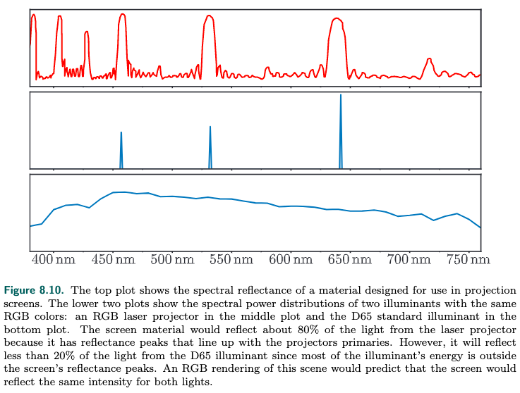

<!-- TOC -->

- [_8.1 Light Quantities光的度量](#_81-light-quantities光的度量)
  - [_8.1.1 Radiometry](#_811-radiometry)
  - [_8.1.2 Photometry](#_812-photometry)
  - [_8.1.3 colorimetry](#_813-colorimetry)
  - [_8.1.4 Rendering with RGB Colors](#_814-rendering-with-rgb-colors)
- [_8.2 Scene to Screen](#_82-scene-to-screen)
  - [_8.2.1 High Dynamic Range Display Encoding](#_821-high-dynamic-range-display-encoding)
  - [_8.2.2 Tone Mapping色调映射](#_822-tone-mapping色调映射)
    - [Tone Reproduction Transform](#tone-reproduction-transform)
    - [Exposure](#exposure)
  - [_8.2.3 Color Grading](#_823-color-grading)

<!-- /TOC -->

**Light and Color**

### _8.1 Light Quantities光的度量

从物理角度来度量light我们用radiometry  
从人的感知角度来度量light我们用photometry  
色彩的感知我们用colorimetry

#### _8.1.1 Radiometry

radiometry通过电磁辐射的方式来度量light  
电磁辐射有wavelength, 可见光只是一小部分波长范围的电磁辐射  
radiometry通过下面几种单位来度量light的强度、功率等等:
- radiant flux: 功率  
  radiometry的基本单位, 电磁辐射能量除以时间, 用$\Phi$表示, 单位是watt($W$)
- irridiance:  
  功率再除以面积, 一般用在物体表面, 用$\textit{E}$表示, 单位是$W/m^2$
- radiant intensity:  
  功率除以solid angle, 单位是steradians(sr), 用$\textit{I}$表示, 单位是$W/sr$  
  注: 角度angle是指二维平面上的角度, 单位用radians弧度表示, 而solid angle是指三维空间中的角度. radians是指单位角度在半径是1的圆的弧长, 一个单位圆的radians是2π.  
  steridians就是指单位solid angle在半径是1的球体上的面积, 一个球体的steridians是4π.
- radiance:  
  radiance这个概念在rendering非常重要, 因为camera和eye感知的就是radiance, 它描述了单条射线的强度  
  radiance是功率除以面积再除以solid angle, 用$\textit{L}$表示, 单位是$W/(m^2sr)$  
  因为要除以面积, 就跟入射角度有关系, 面积需要乘以余弦  
  radiance的特性是跟距离、环境无关, 例如我们观察一个物体表面反射的光, 这个反射光的radiance和我们观察的距离和环境无关.  

很多light并不是单一波长构成的, 是有多种波长组成, 我们称之为spectral power distribution(SPD), 但是我们并不用波长来表示light, 因为人眼感受到的是颜色, 并不能很精确的感受到波长, 甚至有些不同的波长组合, 人感受到的颜色是一样的, 所以我们用RGB来表示颜色.

这部分内容在[fundamentals of computer graphics](docs/FundamentalsofComputerGraphics/18_light.md)里也有介绍.

#### _8.1.2 Photometry

radiometry是从物理角度来度量light, 跟人的感知没有关系.  
photometry则是从人的感知角度来度量light.  
photometry的度量方式是和radiometry对应的, 上面讲到了radiometry用4种单位来度量light, photometry也有对应的4种单位, 且含义是一样的  
两者之间有换算关系, 对radiometry的单位乘以一个常数即可, 这个常数根据不同的wavelength而不同, 表现为一条曲线, 书中有图.  
4个单位的对应关系是:

|radiometry:units|photometry:units|
|-|-|
|radiant flux: $\Phi=watt(W)$|luminous flux: lumen(lm)|
|irridiance: $\textit{E}=W/m^2$|illuminance: lux(lx)|
|radiant intensity: $W/sr$|luminous intensity: candela(cd)|
|radiance: $\textit{L}=W/m^2sr$|luminance: $cd/m^2=nit$|

luminance用来表示物体表面的亮度, 例如HDR电视的亮度是50-100nits

#### _8.1.3 colorimetry

8.1.1章节说到我们感受到颜色和SPD(spectral power distribution)相关, 但是这并不是一一对应的, 不同SPD的光我们感受到的颜色可能是一样的. colorimetry就是处理SPD和颜色的关系.

人类之所以能感受到颜色, 是因为人的retina视网膜里面有三个视锥体, 能感受到不同wavelength, 所以我们用三个变量来表示颜色.

CIE(国际照明委员会)制定了RGB三原色, 通过调整三原色的强度来测量不同波长的单波长颜色, 得到r的wavelength是645nm, g是526nm, b是444nm.  
CIE定义了三个参数$\textit{X, Y, Z}$来表示不同波长的light, 这个公式称之为color-matching functions. 这三个系数并不对应rgb, 其中$\textit{Y}$对应亮度(luminance), 测量出来可以得到这样的曲线:

对于SPD的光呢(也就是不是单一wavelength, wavelength分布在一定范围), 我们采用积分的方式, 计算曲线覆盖的面积, 计算得到三个面积$\textit{X, Y, Z}$.

我们还可以把三个系数减少为两个系数, 将三个系数转换为0-1的空间, $x = \frac{\textit{X}}{\textit{X+Y+Z}}, y=\frac{\textit{y}}{\textit{X+Y+Z}}, z=1-x-y$, 这样我们只需要xy值, 从而得到下面的图:

黑色的曲线是wavelength, 两个端点是wavelength的上下界.  
xy值经过了缩放, 只能表示颜色的构成, 但是颜色还有一个特性是亮度(luminance), 相同的颜色可能有不同的亮度.

显示器有RGB三通道, 三通道控制显示元件发出不同系数不同强度(缩放)的光线从而显示不同的颜色.  

上图有三个三角形, 分别是不同的显示器能显示的颜色范围, 三个顶点是能显示最高饱和度的RGB三色, 所以他们的白点也是不一样的.  
再加上不同的强度就构成了不同的RGB space. RGB和XYZ有换算关系, 不同的RGB space不一样.

在real time rendering里sRGB space应用最普遍.

#### _8.1.4 Rendering with RGB Colors

严格的说, 我们用RGB来做基于物理的渲染是错误的, 因为RGB时基于人的感知, 而不是基于物理的spectral.  
更准确的方法是用spectral渲染, 然后转换为RGB.  

但大多数场景下用RGB来进行渲染是没有问题的.  
比如很普遍的场景, 观察物体变面的反射, 渲染的方法是用物体的RGB乘以反射的RGB, 得到我们观察到的颜色.  
但是一些特殊的场景下就会出现错误, 比如日光和激光投影仪发出的光都是白光, RGB是一样的, 但是spectal不一样, 如下图所示, 激光的反射率达到80%(因为激光有rgb三种波长构成, 这3个波长刚好反射率很高), 日光的反射率是20%(波长范围均匀分布), 照射到墙上的效果是不一样的, 但是用RGB渲染的话就是一样的, 当然这是比较极端的情况, 多数情况spectral分布比较平滑.

这里要说的就是同色异谱的情况可能就会造成RGB渲染出错. 但是大多数情况RGB渲染都表现很好.

### _8.2 Scene to Screen

接下来的几章着眼于physical based rendering(PBR). PBR的目的是计算一个虚拟场景的radiance, 使其和真实的一样. 要实现这个目标还有很多工作要做. 最后的结果, 显示器framebuffer的pixel value, 仍然需要确定. 这一章我们着眼于此.

#### _8.2.1 High Dynamic Range Display Encoding

HDR使用Rec. 2020和Rec. 2100标准, sRGB(个人电脑的色彩范围)的色彩范围更广, 但是白点是一样的. 如下图所示:  

Rec. 2100定义了两种nonlinear display encoding: perceptual quantizer(PQ)和hybrid log-gamma(HLG). HLG在渲染里不使用, 我们主要关注PQ.

HDR display现实中的色彩范围接近于DCI-P3. 所以HDR显示器按实际显示的能力执行内色调色域映射.  
有三种途径将image transfer到display:
1. HDR10
2. scRGB
3. Dolby Vision

#### _8.2.2 Tone Mapping色调映射

之前我们讲到了scene radiance encoding(gamma encode), 以及display的electrical optical transfer function(EOTF)(gamma decode). 两者是互逆的. 

tone mapping或者tone reproduction是gamma encode之前的一个过程, 它将scene的radiance valu转换为display的radiance value. 这个过程中应用的变换称为end-to-end transfer function或者scene-to-screen transform. 经过tone mapping, image由scene-refered image变成了display-refered image. 请注意, 变换之后的image还是线性的, 这不同于gamma encode. 下面这张imaging pipeline的图片可以说明这一点:  
  

tone mapping是一种image repoduction. 目的是让显示器显示的image尽可能和真实的场景一样.  
还有一种image reproduction是为了让image看起来更好为第一目的, 而不是更加还原真实的场景.  

为什么显示器很难还原现实场景? 因为现实场景的亮度范围比显示器可显示的亮度能力大得多, 颜色的saturation饱和度也超出显示器的能力范围. 尽管如此, 我们还是利用人类的视觉特效, 很好的实现了还原真实场景.

视觉系统有适应性, 昏暗的室内看室外场景, 就算亮度不到真实场景的1%, 人的感受也是差不多的, 只是感知的对比度和色彩会降低.

显示器周围的环境光也会影响视觉系统的感受, 还有显示器的瑕疵和眩光也会降低image的对比度. 所以我们需要增大image的对比度和色彩饱和度.

但是提高对比度又会造成另外的问题. 显示器的亮度范围是有限的, 它将现实场景的亮度范围裁剪到了一个有限的范围, 如果提高对比度, 这个范围就进一步缩小了(因为提高对比度把原来的0.9亮度提高到了1, 原来的1就现实不了了, 可不就是缩小了). 为了解决这个问题, soft roll-off可以用来恢复被裁减的阴影和高光.

koda和其他公司实现了很好的image production. 所以形容词filmic会经常出现在tone mapping里.

exposure曝光在tone mapping里至关重要. exposure是在tone reproduction transform之前对scene-refered image进行线性变换. 

exposure的缩放和之后的tone reproduction transform称之为global tone mapping, 它对所以pixel执行. 还有local tone mapping, 它对不同的pixel执行不一样的mapping. real time rendering几乎只使用global tone mapping.

需要注意的是, 物理操作只能对scene-refered image进行.

##### Tone Reproduction Transform

tone reproduction transform通常表现为一条一维曲线, 映射scene-refered image和display-refered image的RGB值和亮度. 这种变换会带来其他问题, 例如眩光、变形、超出显示器的色彩范围等等.

很多人提出的变换曲线得到了不同程度的应用. 例如hable提出的hable filmic curve被应用到了很多游戏中, 等等...

Academy Color Encoding System(ACES)将tone mapping分成了两个部分:  
1. reference r endearing transform(RRT). 它将scene-refered值转换为标准的设备中立的空间(output color encoding specification OCES)的display-refered值.
2. output device transform(ODT). 它将OCES的颜色值转换为显示器的值. 不同的显示器和不同的环境有不同的ODT.
两者组成完整的tone mapping.  
Hart建议ACES对SDR和HDR都要支持.

ACES是为了电影和电视设计的, 但是在real time应用里也得到了越开越多的应用. 例如unreal engine和unity engine都支持ACES. Narkowicz和Patry都给ACES RRT提出了曲线, Hart为ODT提出了参数化版本, 适用于很多设备.

对于HDR的tone mapping需要各位注意, 因为HDR显示器有自己的tone mapping.  
frostbite引擎的策略是使用一系列tone mapping. 对于SDR采样比较激进的tone reproduction curve, 对于HDR采样比较柔和的tone reproduction curve, 对于使用dolby vision path的显示器则不执行tone mapping(其使用自己的tone mapping就可以了). 

##### Exposure

计算exposure值依赖于分析scene-refered的亮度值, 这个分析通过上一帧的采样完成.

一种方法是计算采样的亮度的对数平均值. 这个方法的缺陷是个别亮度值比较高的采样会影响计算结果. 替代的方法是用亮度值的histogram直方图计算median中位数.

这样的复杂操作的原因是根据pixel的亮度值来决定exposure不靠谱. 更好的方法是用光照.

#### _8.2.3 Color Grading

上一节里讲到有些tone mapping的目的是为了实现更好看的色调, 而不是还原更真实的场景. 这就需要操作场景的颜色, 涉及到color grading.

color grading最开始是在电影界应用, 对样例进行交互式的操作测试, 找到需要的效果, 然后应用到所有的场景中. color grading现在在游戏界也得到了广泛的应用.

可以对scene-refered image进行color grading, 也可以对display-refered image进行color grading.  
对display-refered image进行color grading更容易操作, 但是对scene-refered image进行color grading能获得高保真的效果.