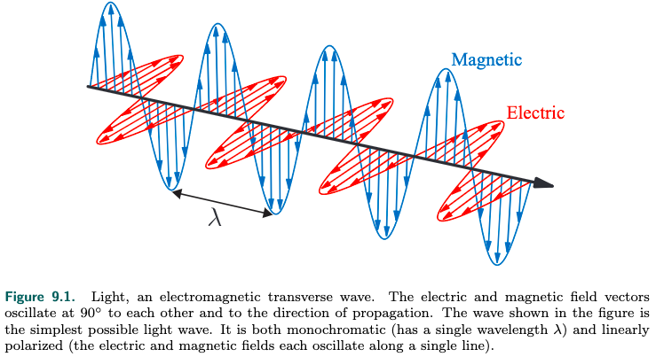
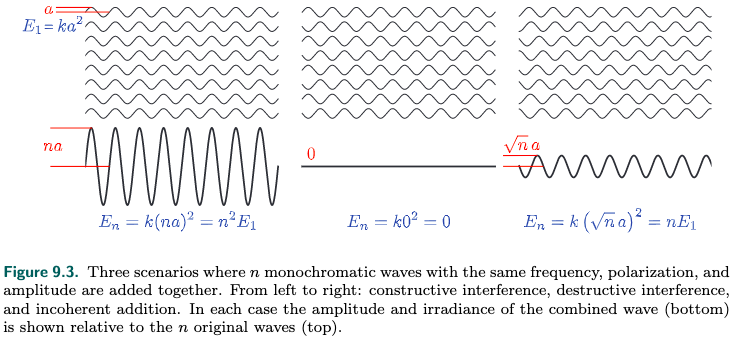
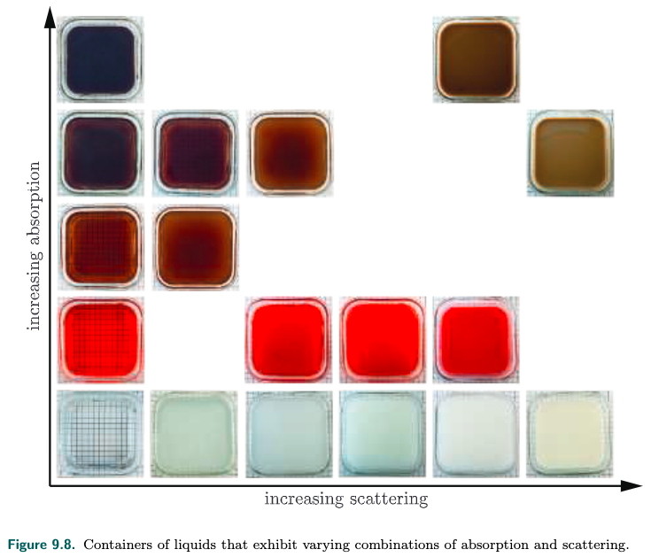
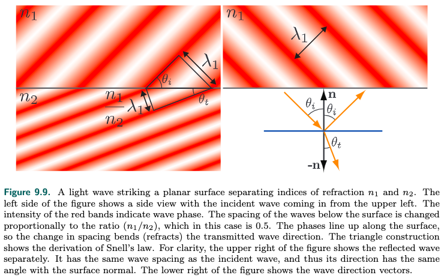
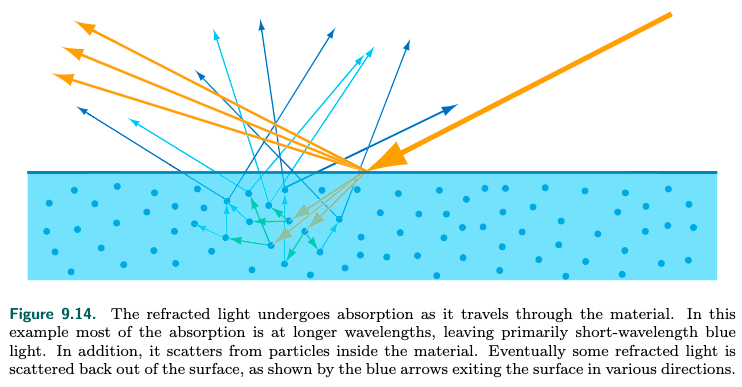

<!-- TOC -->

- [_9.1 Physics of Light](#_91-physics-of-light)
  - [_9.1.1 Particles粒子](#_911-particles粒子)
  - [_9.1.2 Media介质](#_912-media介质)
  - [_9.1.3 Surfaces表面](#_913-surfaces表面)
  - [_9.1.4 Subsurface Scattering下表面散射](#_914-subsurface-scattering下表面散射)

<!-- /TOC -->

**Physical Based Shading**

### _9.1 Physics of Light

光和物体的相互作用构成了physical based shading的基础. 所以我们需要了解light的物理特性.

在物理上, 光是电磁波, 电场和磁场垂直于电磁波的传播方向震动, 电场和磁场又是相互垂直的, 他们具有相同的频率(我们更关注电场, 电场对物体的作用更大). 如下图所示:

wavelength用$\lambda$表示, light的颜色和wavelength相关, 单波长的光称之为monochromatic light, 但是大多是情况光都是多波长组合的, 称之为polychromatic.

可见光的波长范围大概在400nm-700nm之间, 相当于蜘蛛丝的1/3-1/2, 不到人头发的1/15.

光传播能量, 用irridiance($\textit{E}$)来度量, 能量和电磁波的振幅的平方相关相关, $\textit{E}=ka^2$, $k$是一个常数.

图的左边: n个相同振幅的光叠加, 相位一致, 那么叠加后$\textit{E}_n = k(na)^2 = n^2\textit{E}_1$, 这称为constructive interference  
图的中间: 刚好波峰波谷叠加, 那么$\textit{E}_n = k0^2 = 0$, 这称为destructive　interference  
这好像不满足能量守恒定律, 看图的右边: 但是如果随机相位叠加, $\textit{E}_n = k(\sqrt{n}a)^2 = n\textit{E}_1$  
两个相同振幅的光源向四面八方发射的电磁波相叠加, 三种情况的相位叠加都有, 所以这和能量守恒定律不矛盾.  

光和物体怎么相互作用呢? 光波传播碰到物体时, 震动的电场会推动物体里的电场震动, 从而在另一个方向也产生新的光波, 这种现象称之为scattering. 新的光波的频率和旧的光波的频率相同(这里指的是单一频率), 入射光的某个频率是不对出射光的不同频率有贡献的.

光波碰到molecule分子会往四面八方发生scattering, 更多的scattering往原始光波的方向传播, 正向或者逆向. wavelength的光波更容易scattering. 渲染关注molecule集合的scattering.

#### _9.1.1 Particles粒子

在理想气体中, molecule没有关联, 也就是其位置和运动不受其他colecule的影响, 所以scattering的相位也是随机的, 满足上面说的第三种情况, incoherent, 能量守恒.  
但是如果molecule cluster的密度很高, 集中在一个远小于光波的wavelength的区域, 他们scattering后光波的相位就一致了, 这就形成了能量指数增加的情况. 这种现象是存在的, 例如云和雾的scattering特别强, 就是因为水分子凝结, 密度很大. 云的渲染会特别拿出来研究.
particle在light scattering既可以指单个molecule, 也可以指molecule cluster.  
如果particle的直径小于光波的wavelength, 那么scatering更倾向于往四面八方发射, 这称为rayleigh scattering(瑞利散射). 例如天空为什么是蓝色, 应为太阳光遇到空气分子发生了scattering, 空气分子小于可见光的wavelength, 而蓝色的wavelength较小, 更容易scattering, 所以我们看天空是蓝色, 在早上和傍晚, 蓝色被scattering到别的区域了, 所以我们看到的是红橙色. 而月球上没有空气, 在白天天空也是黑色的.   
如果particle的直径大于光波的wavelength, 那么scattering更倾向于往原始光波的方向传播, 而且大多数波长的可见光都会被scattering, 这称之为mie scattering(米尔散射). 例如从窗户进来的光, 因为屋内灰尘较多, 我们能看到光束, 灰尘在其中飞舞. 这也成为丁达尔效应.

#### _9.1.2 Media介质

光在homogeneous media(均匀介质)中传播时, 会发生什么呢?  
光会与其中的molecule发生散射, 但是除了光的传播方向, 散射叠加发生destructive interface, 所以最终的结果光还是会沿着原有的方向传播(这里指的是光在均匀介质中还是直线传播, 不是指的光从一个medium到另外medium的方向变化), 但是phase velocity(就是传播速度)会变化, 有的时候amplitude振幅也会变化.  

光的原有phase velocity和scattering之后的phase velocity的比值就是这个medium的index of refraction(IOR折射率), 或者称为refractive index. 用字母$\textit{n}$表示.  
有的medium具有吸收性, 会将光转化为热能, 这样光的amplitude会变小, 这个衰减的速度用attenuation index衰减指数表示, 可以用字母$\kappa$表示.  
这两个指数都和wavelength相关, 我们将他们组合在一起, $\textit{n+i}\kappa$, 称之为*complex index of refraction*.  
因为medium的吸收性, 所以一些液体会呈现出颜色, 例如茶.

nonhomogeneous medium非均匀介质可以理解为homogeneous media加入了scattering particle. particle的特性见上一节.

scattering和absortion都和medium的体积相关, 例如水是透明的, 大量的水(湖海)呈现蓝色, 少量的空气是透明的, 大量的空气看着雾蒙蒙的.

介质的外观由scattering和absorption两种因素决定, scattering越高, medium的外观就越不透明. absortion决定了medium的颜色.

#### _9.1.3 Surfaces表面

surface可以理解为一个二维界面, 它分隔了两种不同refracrive index的volume.  
在典型的渲染场景下, 这个surface分隔了空气和其他volume. 空气的折射率很低, 1.003, 可以近似为1, 也就是真空.

光打到surface上的interface效果取决于surface两边的refractive index, 以及surface的形状, 在这里我们先假定surface是一个平面, 光从refractive index为$n_1$的volume射向refractive index为$n_2$的volume.

光传播的特性是, 电场必须连续, 光就必须透过surface进入另外一边的volume, 或者反射继续在自己的volume传播, 前者产生transmitted wave, 后者产生reflected wave. 如下图所示:

看左侧: 红色表示电场的震动方向和相位, 经过中间的surface之后, 相位还是连续的.  
光传播还有一个特性是频率不变, 但是因为refractive index不一样, phase velocity会变化, 图中$n_2 \gt n_1$, phase velocity变小, 所以wavelength也要变小. 所以:
$$\sin\theta_t = \frac{n_1}{n_2}\sin\theta_i$$

refraction不只发生于透明物体, 也发生于不透明物体, 只是不透明物体更多的吸收了光.

这种refraction的现象在refractive index在一个wavelength范围内急剧变化的情况下会发生, 如果refractive index缓慢变化, 光的传播就会弯曲, 例如夏天的热空气, 或者炉子上空的热空气, 我们会看到后年的景象会变形.

如果surface隔开了两个物质, 但是这两个物质的refractive index相同, 那么我们就看不到这个surface了, 书中举了个例子, 有颜色的玻璃球放到水中, 玻璃球的refractive index和水一样, 我们看不到比例球的表面, 但是我们能看到颜色轮廓, 这只是因为玻璃球有absorption. 在空气中的玻璃球我们就能清晰的看到.

接下来我们来说surface的形状, 上面我们假定surface是平面, 但是实际世界上时不存在完美的平面的, 就算是单个原子或者原子直线排列的surface也不是完美的平面. 但是surface的不规则可小可大, 如果不规则小于波长, 那么对光的传播不影响, 如果不规则远大于波长, 这不影响局部的平整性. 只有这种不规则的尺寸介于1-100倍的wavelength, 才会影响光的传播, 产生干涉或者衍射的现象.

在rendering里, 我们采用的是geometrical optics几何光学, 它不考虑干涉或者衍射的现象, 因为干涉和衍射和波动相关, geometrical optics把light看成ray, 而不是wave. 上面refraction的图里, 右下角就是geometrical optics的表示法, 另外三张图就是wave的表示法. wave optics会有专题研究.

表面的不规则会影响光线的传播, 加入这种不规则小于一个像素, 那么这个像素下光线的传播也是不规则的, 这就涉及到microgeometry微观几何. 例如书中举的例子, 同样形状的一个物体, 但是microgeometry不一样, 呈现出来的光泽也不一样.

在渲染中, 我们并不会把surface的microgeometry显示的建模, 也就是说用将这些细微的几何变化表示出来, 而是还把它当作连续的表面, 对其法线的变化进行统计, 从而, 拿reflect反射来说, 光线照到surface, 因为microgeometry的不规则, 反射不止往一个方向传播, 而是根据发现的分布统计得到反射方向的比例.

#### _9.1.4 Subsurface Scattering下表面散射

金属反射大部分光线, 吸收剩余的小部分光线. 非金属表现出多种多样的反射折射的现象. 透明的介质低scattering低absorption, rendering相对基础. 这里我们讲不透明的介质, 它表现为光线refractive进入介质之后, 经过scattering又穿过surface传播出来, 如下图所示:

这样的光称为subsurface-scattered light. 出射光的位置分布不均, 和介质中的scattering particles的密度和特性相关.  
这种情况的渲染除了介质的特性, 还和rendering的pixel大小息息相关, 假如一个pixel覆盖了一个入射点的subsurface scattering所有出射光的位置, 那么我们就可以认为出射光的位置和入射点一致, 用diffuse term就可以表达这种*local subsurface scattering*  
但是如果pixel较小, 不能覆盖出射光的位置, 就需要用奥*global subsurface scattering*  

同一张图可能同时用到local subsurface scattering和global subsurface scattering, 例如一个小孩在玩气球, 小孩在近处, 气球在远处, 小孩的皮肤和气球都有subsurface scattering的特性, 因为小孩离得近, 渲染其皮肤需要用到global subsurface scattering, rendering气球需要用到local subsurface scattering.