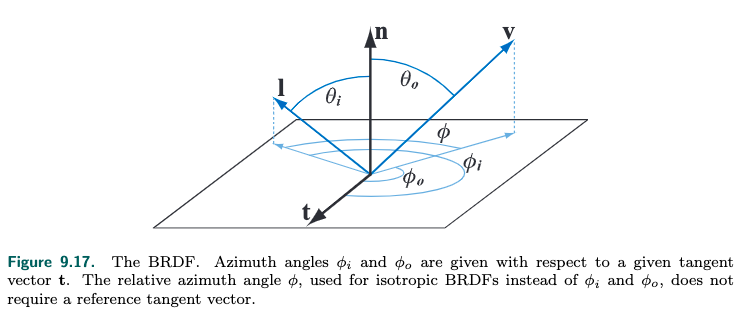
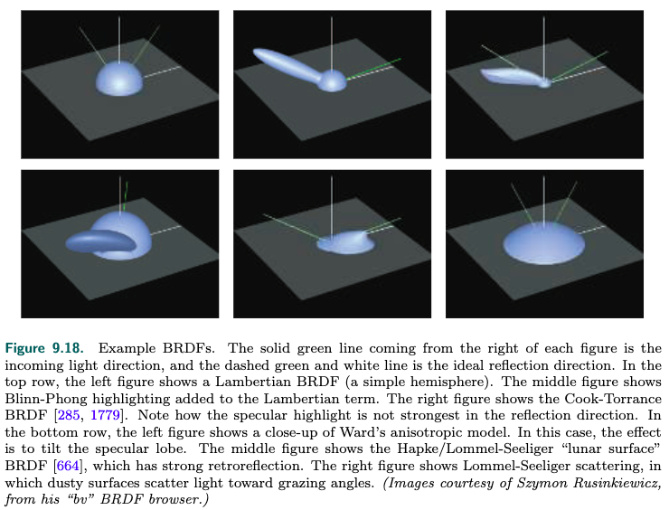

<!-- TOC -->

- [_9.1 Physics of Light](#_91-physics-of-light)
  - [_9.1.1 Particles粒子](#_911-particles粒子)
  - [_9.1.2 Media介质](#_912-media介质)
  - [_9.1.3 Surfaces表面](#_913-surfaces表面)
  - [_9.1.4 Subsurface Scattering下表面散射](#_914-subsurface-scattering下表面散射)
- [_9.2 The Camera](#_92-the-camera)
- [_9.3 The BRDF](#_93-the-brdf)
- [_9.4 Illumination](#_94-illumination)
- [_9.5 Fresnel Reflectance](#_95-fresnel-reflectance)
  - [_9.5.1 External Reflection外部反射](#_951-external-reflection外部反射)
  - [_9.5.2 Typical Fresnel Reflectance Values](#_952-typical-fresnel-reflectance-values)
    - [Fresnel Reflecrance Values for Dielectrics](#fresnel-reflecrance-values-for-dielectrics)
    - [Fresnel Reflecrance Values for Metals](#fresnel-reflecrance-values-for-metals)
    - [Fresnel Reflecrance Values for Semiconductors](#fresnel-reflecrance-values-for-semiconductors)
    - [Fresnel Reflecrance Values in Water](#fresnel-reflecrance-values-in-water)
    - [Parameterizing Fresnel Values](#parameterizing-fresnel-values)
  - [_9.5.3 Internal Reflection内部反射](#_953-internal-reflection内部反射)
- [_9.6 Microgeometry](#_96-microgeometry)
- [_9.7 Microfacet Theory微表面理论](#_97-microfacet-theory微表面理论)
- [_9.8 BRDF Models for Surface Reflection](#_98-brdf-models-for-surface-reflection)
- [_9.9 BRDF Models for Subsurface Scattering](#_99-brdf-models-for-subsurface-scattering)
  - [_9.9.1 Subsurface Albedo](#_991-subsurface-albedo)
- [_9.12 Layered Materials](#_912-layered-materials)

<!-- /TOC -->

**Physical Based Shading**

### _9.1 Physics of Light

光和物体的相互作用构成了physical based shading的基础. 所以我们需要了解light的物理特性.

在物理上, 光是电磁波, 电场和磁场垂直于电磁波的传播方向震动, 电场和磁场又是相互垂直的, 他们具有相同的频率(我们更关注电场, 电场对物体的作用更大). 如下图所示:

wavelength用$\lambda$表示, light的颜色和wavelength相关, 单波长的光称之为monochromatic light, 但是大多是情况光都是多波长组合的, 称之为polychromatic.

可见光的波长范围大概在400nm-700nm之间, 相当于蜘蛛丝的1/3-1/2, 不到人头发的1/15.

光传播能量, 用irridiance($\textit{E}$)来度量, 能量和电磁波的振幅的平方相关相关, $\textit{E}=ka^2$, $k$是一个常数.

图的左边: n个相同振幅的光叠加, 相位一致, 那么叠加后$\textit{E}_n = k(na)^2 = n^2\textit{E}_1$, 这称为constructive interference  
图的中间: 刚好波峰波谷叠加, 那么$\textit{E}_n = k0^2 = 0$, 这称为destructive　interference  
这好像不满足能量守恒定律, 看图的右边: 但是如果随机相位叠加, $\textit{E}_n = k(\sqrt{n}a)^2 = n\textit{E}_1$  
两个相同振幅的光源向四面八方发射的电磁波相叠加, 三种情况的相位叠加都有, 所以这和能量守恒定律不矛盾.  

光和物体怎么相互作用呢? 光波传播碰到物体时, 震动的电场会推动物体里的电场震动, 从而在另一个方向也产生新的光波, 这种现象称之为scattering. 新的光波的频率和旧的光波的频率相同(这里指的是单一频率), 入射光的某个频率是不对出射光的不同频率有贡献的.

光波碰到molecule分子会往四面八方发生scattering, 更多的scattering往原始光波的方向传播, 正向或者逆向. wavelength的光波更容易scattering. 渲染关注molecule集合的scattering.

#### _9.1.1 Particles粒子

在理想气体中, molecule没有关联, 也就是其位置和运动不受其他colecule的影响, 所以scattering的相位也是随机的, 满足上面说的第三种情况, incoherent, 能量守恒.  
但是如果molecule cluster的密度很高, 集中在一个远小于光波的wavelength的区域, 他们scattering后光波的相位就一致了, 这就形成了能量指数增加的情况. 这种现象是存在的, 例如云和雾的scattering特别强, 就是因为水分子凝结, 密度很大. 云的渲染会特别拿出来研究.
particle在light scattering既可以指单个molecule, 也可以指molecule cluster.  
如果particle的直径小于光波的wavelength, 那么scatering更倾向于往四面八方发射, 这称为rayleigh scattering(瑞利散射). 例如天空为什么是蓝色, 应为太阳光遇到空气分子发生了scattering, 空气分子小于可见光的wavelength, 而蓝色的wavelength较小, 更容易scattering, 所以我们看天空是蓝色, 在早上和傍晚, 蓝色被scattering到别的区域了, 所以我们看到的是红橙色. 而月球上没有空气, 在白天天空也是黑色的.   
如果particle的直径大于光波的wavelength, 那么scattering更倾向于往原始光波的方向传播, 而且大多数波长的可见光都会被scattering, 这称之为mie scattering(米尔散射). 例如从窗户进来的光, 因为屋内灰尘较多, 我们能看到光束, 灰尘在其中飞舞. 这也成为丁达尔效应.

#### _9.1.2 Media介质

光在homogeneous media(均匀介质)中传播时, 会发生什么呢?  
光会与其中的molecule发生散射, 但是除了光的传播方向, 散射叠加发生destructive interface, 所以最终的结果光还是会沿着原有的方向传播(这里指的是光在均匀介质中还是直线传播, 不是指的光从一个medium到另外medium的方向变化), 但是phase velocity(就是传播速度)会变化, 有的时候amplitude振幅也会变化.  

光的原有phase velocity和scattering之后的phase velocity的比值就是这个medium的index of refraction(IOR折射率), 或者称为refractive index. 用字母$\textit{n}$表示.  
有的medium具有吸收性, 会将光转化为热能, 这样光的amplitude会变小, 这个衰减的速度用attenuation index衰减指数表示, 可以用字母$\kappa$表示.  
这两个指数都和wavelength相关, 我们将他们组合在一起, $\textit{n+i}\kappa$, 称之为*complex index of refraction*.  
因为medium的吸收性, 所以一些液体会呈现出颜色, 例如茶.

nonhomogeneous medium非均匀介质可以理解为homogeneous media加入了scattering particle. particle的特性见上一节.

scattering和absortion都和medium的体积相关, 例如水是透明的, 大量的水(湖海)呈现蓝色, 少量的空气是透明的, 大量的空气看着雾蒙蒙的.

介质的外观由scattering和absorption两种因素决定, scattering越高, medium的外观就越不透明. absortion决定了medium的颜色.

#### _9.1.3 Surfaces表面

surface可以理解为一个二维界面, 它分隔了两种不同refracrive index的volume.  
在典型的渲染场景下, 这个surface分隔了空气和其他volume. 空气的折射率很低, 1.003, 可以近似为1, 也就是真空.

光打到surface上的interface效果取决于surface两边的refractive index, 以及surface的形状, 在这里我们先假定surface是一个平面, 光从refractive index为$n_1$的volume射向refractive index为$n_2$的volume.

光传播的特性是, 电场必须连续, 光就必须透过surface进入另外一边的volume, 或者反射继续在自己的volume传播, 前者产生transmitted wave, 后者产生reflected wave. 如下图所示:

看左侧: 红色表示电场的震动方向和相位, 经过中间的surface之后, 相位还是连续的.  
光传播还有一个特性是频率不变, 但是因为refractive index不一样, phase velocity会变化, 图中$n_2 \gt n_1$, phase velocity变小, 所以wavelength也要变小. 所以:
$$\sin\theta_t = \frac{n_1}{n_2}\sin\theta_i$$

refraction不只发生于透明物体, 也发生于不透明物体, 只是不透明物体更多的吸收了光.

这种refraction的现象在refractive index在一个wavelength范围内急剧变化的情况下会发生, 如果refractive index缓慢变化, 光的传播就会弯曲, 例如夏天的热空气, 或者炉子上空的热空气, 我们会看到后年的景象会变形.

如果surface隔开了两个物质, 但是这两个物质的refractive index相同, 那么我们就看不到这个surface了, 书中举了个例子, 有颜色的玻璃球放到水中, 玻璃球的refractive index和水一样, 我们看不到比例球的表面, 但是我们能看到颜色轮廓, 这只是因为玻璃球有absorption. 在空气中的玻璃球我们就能清晰的看到.

接下来我们来说surface的形状, 上面我们假定surface是平面, 但是实际世界上时不存在完美的平面的, 就算是单个原子或者原子直线排列的surface也不是完美的平面. 但是surface的不规则可小可大, 如果不规则小于波长, 那么对光的传播不影响, 如果不规则远大于波长, 这不影响局部的平整性. 只有这种不规则的尺寸介于1-100倍的wavelength, 才会影响光的传播, 产生干涉或者衍射的现象.

在rendering里, 我们采用的是geometrical optics几何光学, 它不考虑干涉或者衍射的现象, 因为干涉和衍射和波动相关, geometrical optics把light看成ray, 而不是wave. 上面refraction的图里, 右下角就是geometrical optics的表示法, 另外三张图就是wave的表示法. wave optics会有专题研究.

表面的不规则会影响光线的传播, 假如这种不规则小于一个像素, 那么这个像素下光线的传播也是不规则的, 这就涉及到microgeometry微观几何. 例如书中举的例子, 同样形状的一个物体, 但是microgeometry不一样, 呈现出来的光泽也不一样.

在渲染中, 我们并不会把surface的microgeometry显示的建模, 也就是说用将这些细微的几何变化表示出来, 而是还把它当作连续的表面, 对其法线的变化进行统计, 从而, 拿reflect反射来说, 光线照到surface, 因为microgeometry的不规则, 反射不止往一个方向传播, 而是根据发现的分布统计得到反射方向的比例.

#### _9.1.4 Subsurface Scattering下表面散射

金属反射大部分光线, 吸收剩余的小部分光线. 非金属表现出多种多样的反射折射的现象. 透明的介质低scattering低absorption, rendering相对基础. 这里我们讲不透明的介质, 它表现为光线refractive进入介质之后, 经过scattering又穿过surface传播出来, 如下图所示:

这样的光称为subsurface-scattered light. 出射光的位置分布不均, 和介质中的scattering particles的密度和特性相关.  
这种情况的渲染除了介质的特性, 还和rendering的pixel大小息息相关, 假如一个pixel覆盖了一个入射点的subsurface scattering所有出射光的位置, 那么我们就可以认为出射光的位置和入射点一致, 用diffuse term就可以表达这种*local subsurface scattering*  
但是如果pixel较小, 不能覆盖出射光的位置, 就需要用奥*global subsurface scattering*  

同一张图可能同时用到local subsurface scattering和global subsurface scattering, 例如一个小孩在玩气球, 小孩在近处, 气球在远处, 小孩的皮肤和气球都有subsurface scattering的特性, 因为小孩离得近, 渲染其皮肤需要用到global subsurface scattering, rendering气球需要用到local subsurface scattering.

### _9.2 The Camera

在rendering时我们计算的是着色点到观测位置的radiance. camera也是一样的原理.  
关于camera的知识可以看[GAMES101的第19节课](https://www.bilibili.com/video/BV1X7411F744?p=19)

### _9.3 The BRDF

在[fundamentals of computer graphics](docs/FundamentalsofComputerGraphics/18_light.md#_1816-brdf)和GAMES101里, 我们知道BRDF反应了物体的材质, 英文全称是bidirectional reflectance distribution function. 它是一个函数, 可以表示物体的材质的反射率.

这一章节我们进行详细解释.  
我们需要计算camera接收到的radiance, 那么这个值和camera的位置, 以及着色点和camera的向量有关系, 我们这么表示$L_i(c, -v)$, $L$是radiance的表示, 在8.1章节里讲过, $c$代表camera的位置, $v$代表着色点到camera的向量, 因为这里是以camera的角度来讲, 所以我们价格负号.

rendering的scene场景是由渲染对象已经充满其中的media组成的, 一般情况下, medium是由纯净的空气构成, 不会发生scattering和absorption(8.1章节讲过), 所以camera接收到的radiance等于着色点向camera发出来的radiance:
$$L_i(c, -v) = L_o(p, v)$$
$p$代表着色点的位置  
对于不是纯净的气体的情况, 我们称其为participating media. 在其他章节会讲.

计算radiance需要根据shading model(5.1章节)来计算  
randiance可能是从surface自己发出, 也可能是从其他地方发出经过surface反射, 我们这里不考虑transparency和global subsurface scattering, 只考虑surface reflection和local subsurface scattering. 统称为local reflectance, 它只和入射光l以及观测方向v相关, 入射光和反射光的radiance之间的关系可以通过BRDF(bidirectional reflectance distribution function)来量化, 表示为$f(l, v)$.

在现实世界中一个表面很难有相同的BRDF, 比如一个金属表面可能有划痕、斑点、污渍, 这都造成BRDF在空间中的变化. 我们称之为spatial varying BRDF(SVBRDF), 或者spatial BRDF(SBRDF), 这种情况很普遍, 我们使用上都简称为BRDF.

在三维世界里, $l$和$v$相对于surface的normal, 必须由两个分量表示: 仰角$\theta$和方位角$\phi$, 如下图所示:  
  
这样, 计算BRDF就由4个因子来计算了. 有一种重要的特殊情况是isotropic(各向同性) BRDF, 我们只需要知道$l$和$v$的方位角的夹角, 就能确定BRDF的值, 这样4个因子降低为3个因子. isotropic BRDF是指l和v的相对位置固定, 旋转surface, BRDF的值保持不变.

我们可以根据BRDF的值来计算radiance的值, 通过reflectance equation:
$$L_o(p, v) = \int_{l \in \Omega} f(l, v)L_i(p, l)(n \cdot l)dl$$
这里是将着色点p接收到的radiance做了integral, 因为它会接受到以发现为轴的半球范围内的所有radiance, $\Omega$代表这个半球, 另外这还和入射角相关, 所以乘上了$n$和$l$的dot product.  
将p去掉, 简化为:
$$L_o(v) = \int_{l \in \Omega} f(l, v)L_i(l)(n \cdot l)dl$$

BRDF要求$l$和$v$必须在surface的上方, 实际操作中因为发现插值或者发现贴图可能导致其在下方, 我们可以通过clamping operation来解决.  

物理上还要求BRDF满足两个条件:
一个是互换性, $f(l, v) = f(v, l)$, 实际操作中如果不满足这个等式, artifact也不会很明显, 离线渲染可能会苛刻一些.  
另外是能量守恒, 反射光的强度不能大于入射光的强度, 同样的, 离线渲染要求比较苛刻, real time rendering只需近似即可.

书中还将到了反射率, directional-hemisphereical reflectance($R(l)$)定向半球反射率(这个推导见[fundamentals of computer graphics](docs/FundamentalsofComputerGraphics/18_light.md#_1816-brdf)), 和hemisphere-directional reflectance($R(v)$)半球定向反射率:
$$
\begin{aligned}
  R(l) = \int_{v \in \Omega} f(l, v)(n \cdot v)dv \\
  R(v) = \int_{l \in \Omega} f(l, v)(n \cdot l)dl
\end{aligned}
$$  
前者是一个入R(l) = \int_射方向$l$, 打到surface上, 反射到四面八方, 然后把四面八方反射的radiance积分起来, 得到一个比值. 后者是将一个点从四面八方接受到的radiance积分除以某个观测方向上的radiance, 得到比值. 因为BRDF有互换性, 两者计算出来是一样的, 我们统称为*directional albedo*  
directional-hemisphere reflectance($R(l)$)更符合直觉, 一条光线打到surface上的一个点, 往半球范围内反射, 把半球范围内的反射的radiance再除以入射光线的radiance可不就是反射率吗. 所以$R(l)$值的范围是[0, 1], 0就代表光都被吸收了, 1代表都被反射了.

最简单的场景lambertian, 只有diffuse(subsurface scattering), BRDF是一个定值, 这样我们可以计算出$R(l) = \pi f(l, v)$, 这在fundamentals of computer graphics中有介绍. 对一个半球再乘以一个余弦积分得到$\pi$  
lambertian场景下反射率$R(l)$就是subsurface albedo(9.9.1有介绍) $\rho_{ss}$, 这样:
$$f(l, v) = \frac{\rho_{ss}}{\pi}$$

下面这张图可以帮助理解BRDF:  
  
我门知道BRDF反映了入射光和出射光的关系.  
一个方向的入射光会往四面八方反射, 只是不同方向强度不一样.  
因为subsurface scattering, 会发生diffuse reflection, 在lambertian surface的情况下, 会往半球的所有方向反射, 且强度一样, 这就是左上角图的情况.  
fresenl specular reflection反映了在镜面方向上会发生比较强的反射, 在上面中间的图上在镜面反射方向会多出来一个长椭圆形, 这是因为microfacet不规则的情况, specular reflection会呈现出模糊, 这个长椭圆形称之为specular lobe.

### _9.4 Illumination

在上面我们说到reflectance equation:
$$L_o(v) = \int_{l \in \Omega}f(l, v)L_i(l)(n \cdot l)dl$$
在global illumination里, $L_i(l)$不只来源于光源, 还来自于其他反射, 需要复杂的计算.  
在local illumination里, $L_i(l)$来自于光源, 是给定的.

directional light场景下, BRDF是固定的, L_i(l)也是固定的, 这样reflectance equation可以这样计算:
$$
\begin{aligned}
  L_o(v) = \int_{l \in \Omega}f(l, v)L_i(l)(n \cdot l)dl \\
  L_o(v) = f(l, v)L_i(l)\int_{l \in \Omega}(n \cdot l)dl \\
  L_o(v) = \pi f(l, v)L_i(l) \\
  L_o(v) = \pi f(l_c, v)c_{light}(n \cdot l_c) \\
\end{aligned}
$$
对于punctial light场景, 也是一样的, 只是光照强度根据距离有衰减, 如果有多个光源, 则加起来就好.

### _9.5 Fresnel Reflectance

在一个scene中, 光从medium传播到object经过surface, 这个intersion的过程可以通过*Fresnel Equation*来描述, 这是由18-19世纪的法国科学家fresnel发明的, 英年早逝, 39岁死于结核病.  
但是它由一个限制条件, 这个surface必须是平面, irregularities必须小于1个可见光波长, 或者大于100倍可见光波长.  
光线作用于surface时会发生reflection和refraction, 会分成reflected part和refracted part.  
reflectance的光线和入射光以surface的normal为轴对称, 方向向量可以这样计算(图上画一下就知道了):
$$r = 2(n \cdot l)n - l$$
反射部分的量记作Fresnel reflectance F, 和入射角$\theta_i$相关.  
之前我们学过[9.1.3 折射率](#_913-surfaces表面), 我们把入射方的refractive index记作$n_1$, 进入方的refractive index记作$n_2$, Fresnel Equation描述了$\theta_i, n_1, n_2$之间的关系.

#### _9.5.1 External Reflection外部反射

external reflection是指光线从一个折射率低的介质往折射率高的介质照射. 比如从空气照着到另外的物体. 空气的折射率可以近似为1.  
上面说到fresnel equation描述了反射的光量, 它和入射角以及两个介质的refractive index有关.  
那么对于制定的物体, 从空气照射, 唯一的变量就只有入射角了.

如果入射角是0度, 也就是垂直于表面照射, fresnel equation得到的结果记为$F_0$, 这个值称为这个物体的characteristic specular color.  
如果入射角慢慢变大到90度, fresenl equation的值$F(\theta_i)$就会变成1, 全部反射.  

我们把fresnel equation的参数$\theta_i$换成入射光向量和发现向量, 这样就变成了$F(n, l)$, 这个函数就是和这个物体的refractive index以及n和l的函数. 这个refractive index不太好测量, 比较复杂. 有没有更简单的方法呢? Schlick发明了一个近似表达:
$$F(n, l) \approx F_0 + (1 - F_0)(1 - (n \cdot l)^+)^5$$
这个近似非常精确. 而$F_0$比较容易计算:
$$F_0 = \left(\frac{n-1}{n+1}\right)^2$$
fresenl equation更通用的写法:
$$F(n, l) \approx F_0 + (F_{90} - F_0)(1 - (n \cdot l)^+)^p$$
根据实际情况可以修改$F_{90}$和$p$的值. 可得到不同的效果.

#### _9.5.2 Typical Fresnel Reflectance Values

物质在光学上被氛围三类:
1. dielectrics电介质, 它是绝缘体
2. metals金属, 导体
3. semiconductors半导体

##### Fresnel Reflecrance Values for Dielectrics

例如玻璃, 木头, 塑料, 石头, 混凝土等等都是dielectrics, 水也是dielectrics, 我们一般都会觉得水是导电的, 但这这是因为水里面含有杂质.  
dielectrics的特性是$F_0$很低, 而且对于不同频率的光都差不多, 0.04可以作为默认值, 书中列了一些dielectrics的$F_0$的值.  
那么光都去哪儿了? scatter或者absorb.

##### Fresnel Reflecrance Values for Metals

金属的特性是$F_0$很高, 都大于0.5, 不同频率的光的$F_0$不一样.  
剩余的光都被吸收了, 不会发生subsurace scattering和transparency.

##### Fresnel Reflecrance Values for Semiconductors

semiconductors的物质包括晶体硅等, $F_0$介于最亮的dielectrics和最暗的metals之间, 也就是反射率最高的电介质和反射率最低的金属, $F_0$介于0.2和0.45之间.   
绝大多数场景不会有晶体硅这样的物质需要渲染, 我们也要避免$F_0$的取值介于0.2和0.45之间.

##### Fresnel Reflecrance Values in Water

这个式子指的是从空气进入refractive index为n的物体. 更通用的计算$F_0$写法:
$$F_0 = \left(\frac{n_2-n_1}{n_2+n_1}\right)^2$$
$n_1$不再是1了, 水是1.33, 这样, 因为不同的$F_0$的值, 同样的物体在空气中和在水中呈现的颜色是有差别的.

##### Parameterizing Fresnel Values

$F_0$可以描述characteristic specular color, 有些工业界的公司会用另外的参数来替代$F_0$, 比如用metallic金属度m, 如果m=1, 则$F_0$等于$c_surface$surface color, $\rho_{ss}$duffuse color是黑色, 如果m=0, 则$F_0$等一一个设定的dielectric value, $\rho_{ss}$等于$c_surface$.

#### _9.5.3 Internal Reflection内部反射

internal reflection指的是光线从refractive index比较高的介质往refractive index比较低的介质传播, 比如从水传播到空气.  

external reflection的折射角$\theta_t$小于入射角$\theta_i$, internal refletion的折射角$\theta_t$大于入射角$\theta_i$. $theta_t$不能大于90度, 所以internal refraction时, 入射角$\theta_i$小于90度的时候, 就达到了最大程度的reflectance. 不像external refraction, 入射角$\theta_i$等于90度的时候, 才能达到最大程度的reflectance. 这就是为什么我们在水下看水里的气泡时, 觉得非常的亮.

### _9.6 Microgeometry

9.1.3章节提到了surface的不规则, 当不规则的大小小于一个可见光的wavelength的时候, 我们很难用几何来表示, 我们用发现分布来表示.  

如果发现分布的比较均匀, 那么看起来就会显得模糊和暗淡, 表现出isotric各项同性.  
反之则会显得比较亮, 表现出anisotropic各项异性. 比如锅具的表面, 放大了看, 微表面是平行的线.

微表面的高度也会对外观造成影响, 比如高度比较高, 从侧面看的话, 凹进去的不规则表面被挡住了, 就表现出光滑. 如果从正面看, 则会看到粗糙的情况.

### _9.7 Microfacet Theory微表面理论

facet theory是BRDF模型基于微表面的数值分析.

单元微表面的normal记为m, 对应的BRDF记作$f_{\mu}(l, v, m)$  
normal的分布称之为normal distribution function(NDF), 记作$D(m)$  
$D(m)$的积分就是微表面的面积, 如果投影到宏观表面的normal上, 就得到1:
$$\int_{m \in \Theta}D(m)(n \cdot m)dm = 1$$
如果投影到视线的向量上, 就得到了实现向量和宏观表面的normal的余弦:
$$\int_{m \in \Theta}D(m)(v \cdot m)dm = v \cdot n$$

视线看向微表面的时候是有遮挡的, 也就是微表面的一部分的normal和视线的dot product是小于0的, 就是上面的$v \cdot m$, 我们只需要大于0的部分(看得见的部分), 这部分才需要被渲染, 所以, 我们引入了一个*masking function*: $G_1(m, v)$, 表示normal为m被视线v看到的比例, 然后我门还要把$v \cdot m$做一个clampping operation, 得到:
$$\int_{m \in \Theta}G_1(m, v)D(m)(v \cdot m)^+dm = v \cdot n$$

后面介绍了$G_1$的算法, 它跟m的方向没有关系.

宏观表面的BRDF可以这样计算:
$$f(l, v) = \int_{m \in \Omega}f_{\mu}(l, v, m)G_2(l, v, m)D(m)\frac{(m\cdot l)^+}{|n \cdot l|}\frac{(m\cdot v)^+}{|n\cdot v|}dm$$

$G_2$是对$G_1$的扩展, $G_1$的算法只跟m, v有关, $G_2$的算法还跟l有关.

### _9.8 BRDF Models for Surface Reflection

对于只有specular reflection的场景, 视线v只有和反射方向平行, 才会看到光线. 根据v和l可以计算出中线的向量h, 称之为half vector.  
也就是说只有m和h相等的时候, 才会看到光线. h可以这样计算:
$$h = \frac{l+v}{\|l+v\|}$$
另外微表面的BRDF也只有在这种情况下才有值, 其他方向都是0, 而且这个值就是反射率fresnel equation.  
这样, 根据上一章节计算宏观BRDF的equation, 我们不用积分, 只用考虑这种情况, 得到:
$$f_{spec}(l, v) = \frac{F(h, l)G_2(l, v, h)D(h)}{4|n \cdot l||n \cdot h|}$$
$D(h)$表示的是$h$在NDF中占的比例, $G_2$是这些microfacet能被l和v看到的比例.  
这个equation反应的是specular reflection. 完整的BRDF应该还要包括diffuse reflection, 也就是subsurface scattering.

// _9.8.2 TODO kulla
// TODO NDF model GGX

### _9.9 BRDF Models for Subsurface Scattering

#### _9.9.1 Subsurface Albedo

subsurface albedo是指subsurface scattering的能量和进入介质的总能量之比, 进入介质的能量除了被subsurface scatterred, 剩下就被吸收了. surface albedo用$\rho_{ss}$表示.

subsurface albedo和wavelength相关, 所以他能转化为颜色来表示物体的diffuse color. diffuse color map也被称为albedo color map.  
dielectric的reflection的比例较低, 更多的是进入介质被scatter或者absorb, 所以相比于specular color $F_0$, subsurface albedo更能反映dielectric的颜色. 比如雪的subsurface albedo达到0.8, 显得很亮.  

测量获取subsurface albedo时必须分离specular reflectance.

### _9.12 Layered Materials

在现实世界中, 材质总是叠加在一起. 比如表面被水、冰、灰尘覆盖, 等等

最简单的场景是被一层clear coat透明涂层覆盖, 显著的特点是会发生两次折射, 如果是下面的材料是金属, 那么第二次反射表现会比较显著. 如果是dielectric, 则不会.

clear coat可能会有颜色, 原因是其具有absorption. 多少光被吸收取决于光在其中传播的距离, 这取决于入射的角度和观测的角度. 另外还取决于clear coat的refractive index.

另外, 两种材质surface的法线可能会不一样, 例如水流过一个路面的洼地.

很多引擎视线了对layered material的支持, 甚至包括多层layered.